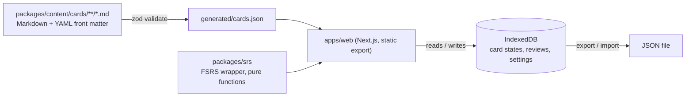

<p align="center">
  
</p>

<h1 align="center">MetaStack</h1>

<p align="center">
  Spaced-repetition flashcards for system design interviews.<br />
  Original cards, rubric-based grading, FSRS scheduling, zero accounts.
</p>

<p align="center">
  <a href="https://github.com/masaok/metastack/actions/workflows/ci.yml"></a>
  <a href="LICENSE"></a>
  
</p>

---

**[Try it](https://metastack.dev)** · [Browse the cards](https://metastack.dev/cards) · [Contribute a card](CONTRIBUTING.md)

## What it is

Most interview prep tells you to "practise out loud". MetaStack is the deck you practise against.

- **64 original cards** in three decks: Fundamentals (39), Estimation (10), Classic designs (15).
- **Rubric grading.** Every card has three to six key points. You reveal, tick what you actually said, and your coverage sets the rating. Design prompts are broken into interview stages (requirements, estimates, API, data model, high-level design, deep dives, failure modes), each with its own rubric.
- **FSRS scheduling** via a small, pure, 100%-tested wrapper around [ts-fsrs](https://github.com/open-spaced-repetition/ts-fsrs). Cards you fumble return tomorrow; cards you nail wait weeks.
- **Nothing to sign up for.** Progress is stored in your browser (IndexedDB) and can be exported or imported as JSON.
- **Keyboard first.** `Space` reveals, `1`–`9` tick key points, `Enter` accepts the suggested rating. Quick mode: `1`–`4` rate directly.
- **Static, fast, dark-mode, mobile, accessible.** 75 pre-rendered pages, no server at runtime.

## Quick start

```bash
git clone https://github.com/masaok/metastack.git
cd metastack
pnpm install
pnpm dev          # http://localhost:3000
```

Requires Node 20.9+ and pnpm 12 (`corepack enable` will pick up the pinned version).

Other useful commands:

```bash
pnpm validate      # lint every card against the schema
pnpm test          # unit tests for the scheduler and content pipeline
pnpm test:coverage # same, enforcing 100% on packages/srs
pnpm e2e           # Playwright drill-flow tests
pnpm build         # static production build
```

## How it works



1. Cards are Markdown files with front matter. A compile step validates them with [zod](https://zod.dev) (closed tag vocabulary, 3–6 key points, at least one public reference, `reviewed: true`) and writes a JSON bundle. Invalid cards fail the build.
2. The web app imports that bundle and pre-renders every page.
3. In the browser, `buildSession` merges due reviews with new cards (default limit 10/day), `ratingFromRubric` maps your tick count to a rating, and `rate` asks FSRS for the next due date.

Read more in [docs/ARCHITECTURE.md](docs/ARCHITECTURE.md) and the [ADRs](docs/adr).

## Why FSRS instead of SM-2

SM-2 (1987) multiplies the interval by a fixed ease factor. FSRS fits a three-component memory model (difficulty, stability, retrievability) to your actual review history and schedules for a target retention, 90% by default. Across published benchmarks it needs noticeably fewer reviews for the same retention. [ADR 0002](docs/adr/0002-fsrs-over-sm2.md) has the reasoning and the parameters we use.

## Repository layout

```
apps/web/              Next.js 16 app (App Router, Tailwind v4, Dexie)
packages/content/      cards/*.md, schema, compiler, validator
packages/srs/          FSRS wrapper: createCardState, rate, buildSession, ...
docs/                  architecture notes and ADRs
scripts/check-public.sh  CI guardrail for a public repository
```

## Contributing

The most valuable contribution is a good card. See [CONTRIBUTING.md](CONTRIBUTING.md) for the content rules (original wording, rubric style, references) and run `pnpm validate` before opening a PR. Found an error? [Report it](https://github.com/masaok/metastack/issues/new?template=card-error.yml).

## License

[MIT](LICENSE). Card content is also MIT, written from scratch for this project with references to public sources.
