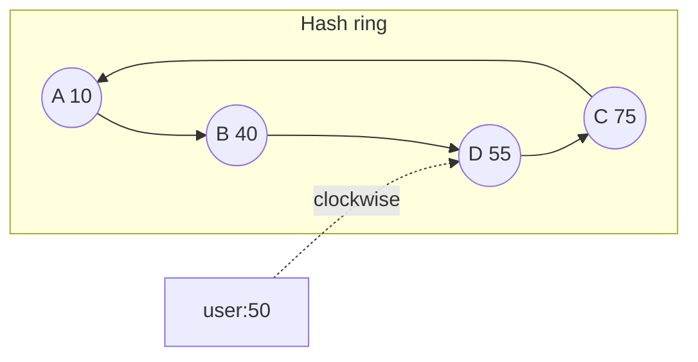

Here is consistent hashing explained the way an interviewer wants to hear it. Hash each node and each key onto a ring. Walk clockwise from the key to the first node you meet. That node owns the key. Add or remove a node and only the keys in that node's arc move, about 1/N of them, instead of almost every key. Virtual nodes put many points on the ring per physical machine so the arcs stay even and a failure scatters load. That is the whole idea. The rest of this post is the problem it solves, a worked example you can redo on a whiteboard, the follow-ups that come next, and how it compares with other ways to shard.

## What hash-mod-N gets wrong

The obvious way to pick a server for a key is `hash(key) mod N`. It is one line. It spreads keys. It is also a disaster the first time N changes.

Take four nodes, labelled 0 to 3, and a hash that lands in 0 to 99. Key 17 goes to 17 mod 4 = 1. Key 42 goes to 2. Key 8 goes to 0. Now you add a fifth node. The same keys remap: 17 mod 5 = 2, 42 mod 5 = 2, 8 mod 5 = 3. Three keys, three new homes. Across the whole key space, going from N to N+1 remaps about N/(N+1) of the keys, four fifths when you go from 4 to 5. The keys that stay put are the ones whose hash happens to satisfy `h mod N = h mod (N+1)`, a small set.

In a cache that is a miss storm. Almost every hot key is now on a cold node, so the backing store takes the full read load until the cache fills again. In a data store it is a migration of most of the data. Either way, the cluster cannot grow without a planned outage or a long, careful copy.

That is the problem the interviewer is waiting for you to name. [The MetaStack card on consistent hashing](/cards/consistent-hashing) opens with it. If you skip it and jump to the ring, you have skipped the reason the ring exists.

## How the ring works

Hash the node's name, or its address, onto a large circle. A 32-bit hash is enough to talk about; production systems often use 128 bits. Hash each key onto the same circle. From a key, walk clockwise until you hit a node. That node owns the key. Equivalently, each node owns the arc that ends at it and starts just after the previous node.

Add a node and it claims only the arc between itself and its counter-clockwise neighbour. Keys on that arc move to the new node. Every other key stays. Remove a node and its arc goes to the next node clockwise. Again, only that arc moves.

The fraction that moves is about 1/N. Going from 4 nodes to 5, you move about a fifth of the keys, not four fifths. The cache stays warm. The data store copies a slice, not the world.

A small example you can draw. Put the ring on 0 to 99 so the numbers fit on a whiteboard.

- Node A hashes to 10.
- Node B hashes to 40.
- Node C hashes to 75.

Keys:

- Key `user:9` hashes to 5. Clockwise from 5 the first node is A at 10. A owns it.
- Key `user:21` hashes to 22. Next node is B at 40. B owns it.
- Key `user:50` hashes to 50. Next node is C at 75. C owns it.
- Key `user:90` hashes to 90. The walk wraps around to A at 10. A owns it.

Now add node D at 55. D claims the arc from just after 40 to 55. `user:50` (hash 50) used to live on C. It now lives on D. The other three keys do not move. One key in four, which is what 1/N predicted.

Remove B. The arc that ended at 40 now ends at C (or at D, if D is still there). Only B's keys move. A's and C's keys stay.

Say this out loud with the numbers. Interviewers do not need the code. They need to see that you can place a key, add a node, and point at the one key that moved.

## Why virtual nodes exist

One point per physical machine leaves two holes.

The first is uneven arcs. Random hashes do not space themselves. On a 4-node ring you can easily get one node owning half the circle and another owning a sliver. Load follows the arcs, so one machine runs hot.

The second is failure. When a node dies, its whole arc lands on the next node clockwise. That neighbour suddenly serves two ranges. If it was already the larger machine, it is now the overloaded one, and it is the one most likely to die next.

Virtual nodes, often called vnodes, put many hash points on the ring for each physical machine. A typical count is 100 to 200 points per node. The arcs become short and mixed. Load evens out because no single unlucky gap can be large. When a machine dies, its many points are scattered, so its keys fan out across many successors instead of dumping onto one neighbour.

Heterogeneous hardware falls out of the same trick. A machine with twice the RAM gets twice the vnodes and owns about twice the keys.

The cost is more metadata. The ring now has thousands of points, and a lookup walks or binary-searches that set. For a cache client or a coordinator this is cheap. For a gossiped membership list it is still small. If you hear "the ring is too big", the answer is usually a tree or a skip list over the points, not fewer vnodes.

A follow-up that uses this: "What happens when one node fails and its neighbour inherits its whole range?" The honest answer without vnodes is "that neighbour takes the full hit". With vnodes the answer is "the failed node's keys scatter across many successors, each taking about 1/V of that node's load, where V is the vnode count".

## Replication on the ring

A key that lives on one node dies with that node. The usual fix is to store the key on the next R distinct physical nodes clockwise from the first owner. Distinct matters: walking onto another vnode of the same machine does not count. Dynamo-style stores do this. So do many cache clusters that keep a replica for hot keys.

On the 0 to 99 ring, with R = 2 and no vnodes, `user:21` (hash 22) has primary B at 40 and replica C at 75. After B dies, C is already a replica and becomes the primary. The next distinct node after C picks up the extra replica. Writes go to both, or to a quorum of them, depending on the consistency you promised.

This is also how you talk about availability zones. Place vnodes so that the next distinct physical node is in a different rack or zone when you can. The ring does not do that for you. The membership layer does, by choosing node identifiers or by skipping same-zone successors when it picks replicas.

Do not claim a specific quorum number unless the interviewer gave you one. N = 3, R = 3, W = 2, R_read = 2 is a common Dynamo-style set, and it is fine to offer as a default if you say it is a default.

## How it compares with other sharding

Interviewers often want the ring set against two other answers. [The sharding strategies card](/cards/sharding-strategies) and [the shard-key card](/cards/choosing-a-shard-key) cover the broader choice. Here is the comparison that belongs in this answer.

| Approach | How a key finds a home | What changes when you add a node | Best when |
| --- | --- | --- | --- |
| Hash-mod-N | `hash(key) mod N` | About (N)/(N+1) of keys move | N is fixed, or you can rebuild |
| Consistent hashing (ring) | Clockwise to the next node | About 1/N of keys move | Caches, storage nodes you add one at a time |
| Range sharding | Key falls in a contiguous range | You split a hot range, only that range moves | Range scans, time series, "users A-M" |
| Directory | A lookup table maps key (or bucket) to node | You rewrite one row | You can afford a lookup hop and want exact placement |
| Rendezvous hashing | Score every node for the key, pick the highest | About 1/N of keys move, no ring | Many nodes, you want to avoid ring metadata |

Range sharding wins when the query is a scan. "All events for user 42 last Tuesday" is a range. A hash ring scatters those events on purpose, which makes the scan a scatter-gather. Say that out loud if the workload has scans.

A directory wins when you need to pin a hot key to a bigger machine by hand. The cost is the directory itself: it has to be right, fast, and highly available. Many systems use a directory of buckets, then consistent-hash the buckets, which is a hybrid that keeps the ring small.

Rendezvous hashing, also called highest random weight, gives the same 1/N movement without storing a ring. For each key you compute `score(key, node)` for every node and pick the max. Adding a node only steals the keys for which it now wins. The lookup is O(N) unless you add a tree. For tens of nodes that is fine. For thousands, the ring or a directory of buckets is cheaper.

Jump consistent hash is compact and fast and only supports adding or removing the last bucket. Mention it if you have a fixed, append-only pool. Do not offer it as a general cache cluster.

## What to say in the interview

Open with the problem, not the name. "If I place keys with hash mod N, adding a node remaps most keys and the cache goes cold. I want a placement where only about 1/N of keys move." Then the mechanism. "I hash nodes and keys onto a ring and walk clockwise." Then the refinement. "I put many virtual nodes per machine so load is even and a failure scatters." Then one use. "This is how I would place keys on a memcached-style cache, or on a Dynamo-style store with replicas on the next R nodes."

Work a tiny example if there is a whiteboard. Four numbers are enough. Point at the one key that moves when a node joins.

Expect these follow-ups. They are the ones on the [consistent hashing card](/cards/consistent-hashing) and the ones that show up around [distributed caches](/cards/distributed-cache).

- **Hot key.** The ring does not save you. A single key still lives on one primary. You cache it, split it, or add a dedicated shard. Virtual nodes do not help a single hot key.
- **Rebalancing without vnodes.** You are stuck with uneven arcs. You can move a node identifier to split a large gap, which is a manual vnode.
- **Request routing.** The client can own the ring and talk to the owner directly. Or a proxy can. Or any node can forward clockwise. Say which you picked and why. Clients with a copied ring are simple and fast, and they need a way to learn membership changes.
- **Membership.** How do nodes learn the ring? Gossip, a config service, DNS. The hashing answer is incomplete without a sentence on this.
- **Rendezvous versus the ring.** Same movement property. Ring is O(log N) with a sorted set of points. Rendezvous is O(N) naive. Pick the ring for a large cluster, rendezvous for a small one where you want less metadata.
- **Estimated traffic.** If the interviewer asks how big a move is, do the 1/N arithmetic out loud. Ten cache nodes, add one, about 9% of keys move. Pair that with [back-of-the-envelope estimation for system design](/blog/back-of-the-envelope-estimation) if you need a miss-rate or QPS number to show the backing store can take the hit.

A short checklist you can keep in your head:

1. Name the remapping problem with hash-mod-N.
2. Place nodes and keys on a ring, walk clockwise.
3. State the 1/N movement.
4. Add virtual nodes for balance and failure scatter.
5. Replicate to the next R distinct physical nodes if the data must survive a node loss.
6. Say where you would not use it (range scans, a single hot key).

## How to make the answer stick

This is a concept card, not a full design. The failure mode in prep is recognition. You read a diagram of a ring, you nod, and two weeks later you cannot place a key on a 4-node example. The fix is the same as for the rest of the deck. Say the answer out loud before you reveal the back, then tick the points you actually said. The [system design interview flashcards](/blog/system-design-interview-flashcards) post is about that grading loop. [Spaced repetition for system design](/blog/spaced-repetition-for-system-design) is about why the card should come back tomorrow if you missed the 1/N point.

On the MetaStack fundamentals deck the prompt is: explain consistent hashing, what problem it solves compared with hash-mod-N, and what virtual nodes are for. The key points are the remapping, the ring and 1/N, vnodes, replication to the next R, and where it is used. If you said four of those five, you know it. If you said "it is a ring" and stopped, you do not.

Drill it on the [fundamentals study page](/study/fundamentals) until the example is boring. The interview will not give you a prepared diagram. It will give you a cache that needs to grow, and you will have to reach for this without hearing the name.
