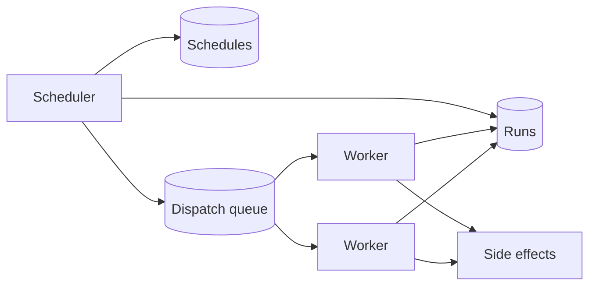

When you design job scheduler systems for an interview, separate the job, the schedule that fires it, and the worker that runs it. A job is the work. A schedule is when that work should start. A worker is a clone that claims a run and reports a result. You will not get exactly-once execution. You will get a lease, a retry, and an idempotent handler. The rest of the answer is catch-up, priority, and a stuck worker.

## The job, the schedule, and the worker

A job is a row. It has an id, a type, a payload, a timeout, and a retry policy. `digest`, `user_id=17`, timeout 60 seconds, up to three tries is a job. Keep the payload small. A pointer to an object beats a 10 MB body in the row. The job does not know which machine will run it.

A schedule is the rule that creates a run. Cron, an interval, or a one-shot at T. The scheduler finds due schedules and inserts a run. The run is the instance. The job is the template. Fuse them and a catch-up looks like a retry.

A run has a state. `pending`, `leased`, `succeeded`, `failed`, `dead`. It has `not_before`, `attempt`, `leased_by`, `lease_until`, and `last_error`. The worker claims a due `pending` run with a compare-and-set. Set state to `leased`, set `leased_by` to this worker, set `lease_until` to now plus the timeout, only if the state is still `pending` or the lease has expired. Two workers cannot both win that write.

Workers are stateless. I pick a queue for dispatch and the run table for truth. The [message queues post](/blog/message-queues-for-interviews) is why the scheduler can finish without waiting. The table is why a lost message is not a lost job. A sweeper reclaims when the lease expires.

The scheduler needs a leader or a sharded lock on the schedule space. Two schedulers that both insert the 8:00 run give you two runs. A leader elected with a lease, or a partition of schedule ids, keeps that insert unique. The unique key is `(job_id, scheduled_for)`. A second insert of the same window fails. That is the same uniqueness idea as an idempotency row.

Walk an 8:00 digest. The scheduler inserts a run, publishes the run id, a worker claims it, sends, marks `succeeded`. If the worker dies after the send and before the write, the lease expires and another worker claims. That is the next section.

APIs you can name. `POST /jobs` to register a template. `POST /jobs/{id}/runs` to force a run. `GET /runs/{id}` for state. A cron string on the job is enough for the interview. Do not design a general workflow language unless the prompt is a workflow product.

## Exactly-once you will not get

A run can start twice. The ack was lost. The lease expired. The queue delivered twice. [Message queues](/blog/message-queues-for-interviews) already tell you at-least-once is the honest default. A scheduler is that default with a clock.

Exactly-once would mean the side effect and the state write commit as one. They do not. The side effect is an email, a fetch, a charge. You cannot wrap a remote call and a row update in two-phase commit and call that the design. You can put an idempotency key on the side effect.

[Idempotency keys](/blog/idempotency-keys) are that row. The key is the run id. The email service stores "this run already sent this digest." A second worker with the same run id gets the stored result and does not send again. A crawl fetcher stores "this URL at this recrawl window already landed." A charge stores the run id the same way a payment stores the client key. Reuse one run id across retries. Do not mint a new id on every attempt if the side effect must happen once.

At-least-once plus idempotency is the sentence. At-most-once acks before the work. A crash loses the run. Use it only when a miss is better than a double send and you have no far-side key. I do not pick it for a crawler or a payment.

A lost scheduler is not a lost run if the row exists. A lost worker is not a lost run if the lease can expire. A lost message is not a lost run if a sweeper republishes `pending` or expired `leased` rows. The table is the source of truth. The queue is a hint. Draw that, or you will "fix" duplicates by deleting the table and then lose work on a broker restart. An outbox makes the insert of the run and the publish of the message one commit. It does not make the email one with that commit. You still need the idempotency key on the handler. The outbox is worth having. It is not exactly-once of the user-visible work.

## Catch-up after a missed window

The scheduler was down from 8:00 to 10:00. Three hourly jobs did not fire. What happens at 10:01.

Three policies. Skip. Run once. Run every missed window.

Skip means 8:00 and 9:00 never exist. Use it when an old snapshot is worthless. A current cache warm. Running 8:00 at 10:05 writes stale work.

Run once creates a single catch-up that covers the gap. A digest that should have gone at 8:00 goes out at 10:01 with everything since the last success. One email, late. I pick this for digests and for a paused recrawl.

Run every missed window inserts 8:00, 9:00, and 10:00. A billing close needs each hour. Without a cap, a day of downtime is a stampede. Say "at most the last six windows." Older windows are marked skipped.

The run table makes the policy visible. A sweeper that reads `last_scheduled_for` and applies the rule is the policy. A feeling is not. Overlapping windows need a lock per job. Two concurrent digests for user 17 can double-send if you minted two run ids. Catch-up-once exists to avoid that. Store `scheduled_for` in UTC. Mention time zones and move on unless the prompt is a calendar.

## Priorities and a stuck worker

Not every run is equal. A payment retry is ahead of a weekly recrawl. Put a priority on the job. Starvation is the failure. A flood of recrawls can hold every worker. Reserve a slice. "Two of ten workers only take interactive jobs" is enough.

A stuck worker holds a lease and does no work. Detection is `lease_until` in the past. The next claim treats the run as free. `attempt` increments. Past the policy, the run goes `dead`. The timeout must be longer than a healthy run and shorter than the pain of a stuck one. A five-second digest can lease for 60 seconds. A long crawl heartbeats to extend the lease. A worker that cannot heartbeat is stuck even if the process is alive.

Poison payloads must not loop. Three failures, then `dead`. The [message queues post](/blog/message-queues-for-interviews) already keeps a dead-letter. The run table is that letter here. Split stuck, slow, and idle. Slow is capacity. Idle with `pending` rows is a dispatcher bug. Only stuck needs a lease steal. Cancel is a state write. The worker checks it on the next heartbeat. Do not cancel by deleting the row. You lose the audit.

## A crawl or a digest that uses it

Two designs make the scheduler concrete. A recrawl. A notification digest.

A web crawler keeps a frontier of URLs. Each URL has a next-visit time from freshness and politeness. That time is a schedule. The job type is `fetch`. The payload is the URL. The worker is a fetcher. Politeness is a per-host lease. One fetch at a time per host, or one per crawl-delay, is a lock the scheduler must honour. Catch-up is "run once" for that URL, not a stampede of every skipped minute. Priority is importance times staleness. A stuck fetcher on a slow host must lose its host lease so another URL on that host is not blocked forever, and so other hosts keep moving. The unique key is `(url, recrawl_window)` so a retry does not double-fetch in the same window without a reason.

A digest is simpler and better for idempotency talk. Every morning, users who opted in get one summary of what they missed. I pick one daily schedule that enqueues per-user runs. A failure on user 17 then does not block user 18. The side effect is an email or a push. The key is `(user_id, digest_date)`. A missed 8:00 with catch-up-once sends one late digest. Run-every-missed would send three. Skip would send nothing for that day. Catch-up-once is the product I would defend. The digest is user-visible and time-bound. It outranks a background recrawl. If the worker pool is short, the recrawl waits. If the digest pool is stuck on a bad template, dead-letter those runs and keep the crawler going. Two job types, two queues, or one queue with a reserved worker slice.

A table you can redraw.

| Piece | Crawler | Digest |
| --- | --- | --- |
| Job | Fetch this URL | Send this user's daily mail |
| Schedule | Next visit from change rate | 8:00 in the user's zone |
| Catch-up | One fetch, not every missed minute | One late mail, not three |
| Exactly-once | Idempotent store of URL plus window | Keyed send on user plus date |
| Stuck worker | Host lease expires, frontier moves | Run lease expires, another worker sends |

The scheduler is not the crawler and not the mailer. It is the clock, the run row, the lease, and the dispatch. The product handlers sit on the other side of the queue. That split is what you came to say. If you draw the fetcher inside the scheduler process, you will not be able to scale either one.

Drill clocks and retries on the [classic designs study page](/study/designs). Run a crawler card until recrawl and politeness sound like a schedule and a lease. Run a notification design until a digest is a job with an idempotency key, not a loop in an API process. Start that loop from [/study](/study).
