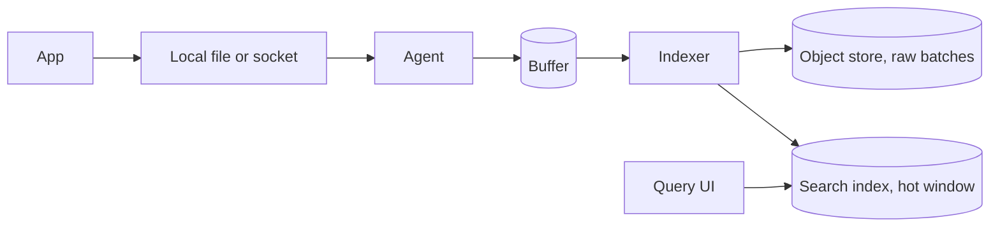

When you design logging system collection for an interview, start with an agent on each host, a buffer that can drop, and a store you can search. A log line is an event, not a number. It carries a request id. It is expensive to keep. It must not take the product down when a host starts shouting. That is the whole case. The rest is how the line moves and how this design differs from metrics.

## Agents, a buffer, and a store you can search

The product writes a line. The agent takes that line off the host. I pick a sidecar or a node agent that tails a structured file. The app then treats logging as a local write. A remote HTTP call on the request path is how a logging outage becomes a user outage.

The agent batches. A few thousand lines or a few hundred milliseconds, whichever comes first. It adds host, service, and timestamp if the app omitted them. It does not parse free text. That work belongs once, at index time, or not at all if the line is already structured.

The buffer sits between the agent and the store. A queue or a log, the same family as [message queues for system design interviews](/blog/message-queues-for-interviews). The product does not wait for the indexer. If the store is slow, the buffer grows. If the buffer is full, the agent drops or samples. It does not block the request thread. A bounded local queue accepts loss. A durable queue in the middle accepts delay instead.

The store has two jobs people fuse. Durability of raw lines. Search. Object storage holds compressed batches for as long as retention says. An inverted index holds a shorter hot window you can query by field. I pick both. Ingest writes the batch to object storage first, or in parallel with the index. A lost indexer can replay from the objects. A search of last year is a restore job, not a giant live index. `service=api AND trace_id=abc` should hit the index, not a scan. Time is a first-class partition. You query the last hour far more than last March. Shard by time and by tenant. A noisy tenant then fills one set of shards. Query is a time range, a field filter, and a limit. Full-text on the message is allowed. It is the expensive path. Offer it. Do not make it the default.



Walk one line through that picture. App, file, agent, buffer, indexer, objects, index. If you cannot, the design still has a hop you have not named. Stop there until you can name every hop on the board.

## Structured lines and a trace id

A structured line is a set of fields a query can use. I pick JSON, one object per line. `timestamp`, `level`, `service`, `message`, `trace_id`, `span_id`, `http_status` if it is an HTTP hop. Add a `user_id` when the line is about one user. That field is welcome on a log. It is poison on a metric.

A trace id is the id every hop of one request writes. The API puts it on the context. The worker that handles the async job writes the same id. The payment call writes the same id. Search it and you get the path. Without it you have timestamps and hope. Spans are the per-hop ids. You can design tracing as its own system. For a logging interview, the trace id on the line is the piece you must not omit. Do not parse `"User 17 failed checkout"` with a regex in the agent. The next release will change the sentence. The field will vanish. If the app cannot emit JSON yet, parse once at ingest into an allow-list of fields and keep the raw message. Do not build a parser farm as the architecture.

Levels are a filter. `ERROR` and `WARN` are the on-call window. `INFO` is the request trail. `DEBUG` is off unless you flip it for one service. The agent can drop `DEBUG` at the host.

Example line, as the app writes it.

```json
{
  "timestamp": "2026-10-03T18:01:22.451Z",
  "level": "ERROR",
  "service": "api",
  "message": "checkout charge failed",
  "trace_id": "8f2a1c",
  "span_id": "b19e",
  "http_status": 502,
  "order_id": "ord_9k"
}
```

That object is searchable. The message is still readable. The order id is a field. A later aggregator can count `http_status=502` without reading the sentence.

PII is a field policy. Do not put a card number or a raw token in the line. Hash or drop. The store will be copied. The query UI will be screenshotted. Treat the line as public to everyone who can search that tenant. If the prompt includes payments or auth, say the allow-list out loud before you draw the indexer.

## Retention versus a metrics rollup

Logs do not downsample the way series do. A metric rollup keeps min, max, sum, and count. The points can go away. A log rollup is a count. The line is gone. You cannot open it later and see the order id.

Keep raw lines for a short window and derived counts for a long one. Seven days of indexed lines is a window you can defend. Thirty days of raw batches in object storage is a second window. Counts by status can live a year in the metrics store. The metrics system is the rollup. The log store is the evidence. Do not promise every line forever and searchable. A year of forensic search is cold objects plus a restore into a temporary index. That restore is hours.

Sampling is the other retention. Keep every `ERROR`. Keep one in N of `INFO`. Keep every line for a trace that already had an error. Head sampling decides at the start of the request. Tail sampling decides at the end and needs a buffer of the whole trace. Name which you are using.

A table keeps the two stores honest.

| What you keep | How long | What it answers |
| --- | --- | --- |
| Indexed structured lines | Days | "Show me this trace." |
| Raw batches in object storage | Weeks | "Restore Tuesday and search again." |
| Counts and rates in metrics | Months to years | "Was 502 up last quarter." |
| Debug lines | Minutes, or off | A live incident on one host. |

If the interviewer asks how you would know a checkout regression from last month, the answer is the metric first, then a restore of the log slice if the metric is not enough. It is not a year-long live grep.

## A spike that must not take down the product

A debug flag left on, or a tight loop, or a stack on every failure. Volume jumps. The product is still the API. The logging path has to fail closed on that side.

The first shed is local. The agent has a bounded queue. When the queue is full it drops `INFO` and `DEBUG` first. It keeps `ERROR` as long as it can. It never blocks the app's local write beyond a short timeout. If the file writer would block, the app drops the line. A missing line is better than a missed checkout.

The second shed is the buffer. Backpressure hits agents, not the API. A noisy host fills a per-service quota, not the shared cluster. [Rate limiting for system design interviews](/blog/rate-limiting-for-interviews) is that quota. A token bucket per service on ingest. Burst, then refuse. The refused batch is dropped or written only to object storage.

The third shed is query. Separate ingest CPU from query CPU. Limit fanout so a `message:*` over a week cannot stall the drain. Do not put an HTTP log call on the request path and retry it. Those retries amplify the spike. The [message queues post](/blog/message-queues-for-interviews) says the producer should move on. Here the producer is the agent.

Assume 1 KB per request at 10,000 requests per second. That is 10 MB/s, about 1 TB/day if it never stops. A bug that logs a 10 KB stack on every request is 100 MB/s. The agent quota has to clip that. If you cannot point at the clip, the product will wait on the disk or the network. Emit a metric for lines dropped by reason. That counter is how you know the spike happened if the lines themselves never arrived. Logging that does not measure its own loss is a black hole.

## How this differs from the metrics design

A metrics design stores numbers. A logging design stores events. The boxes look related. The constraints flip.

Cardinality is the enemy of metrics and the job of logs. A `user_id` label explodes a time-series index. A `user_id` field is why you opened the log UI. The log index still has limits. Structured fields with repeating values stay cheap. High cardinality is allowed. A unique `message` for every line, with no shared fields, is a bad index. Unbounded distinct messages as the only key is not the point of logs either.

Aggregation is native to metrics and lossy for logs. Do not describe a log store as a time-series database with a string column. The query is search, not `rate()` over a year. Ingest is burstier. Metrics arrive on an interval. Logs peak when you need them most. The buffer and the drop policy are central. A metrics stream can be sized for a sample rate. A log stream cannot.

Do not page from a live grep. Page from a metric. A grep alert misses when the indexer is behind. Logs explain. Metrics page. Pull versus push also flips. Scrapers pull `/metrics`. Log agents push. A scraper cannot pull a file tail.

Draw them as siblings that share a trace id and nothing else. The app emits a line and a counter. A page fires from the counter. An engineer searches the trace id. Merge the stores and you blow cardinality or lose cheap rollups.

Drill a full design on the [classic designs study page](/study/designs). Use the metrics-monitoring card for the numeric sibling. Walk this path until the agent, the drop policy, the hot index, and the cold objects come out in order. Start that loop from [/study](/study).
