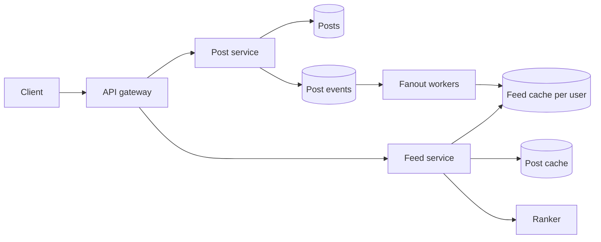

To design news feed reads, build each follower's timeline when the post is written if the author has few followers. Build that timeline when the reader opens the app if the author has millions of followers. Most real designs mix the two.

## The choice you should say first

People publish posts. People follow other people. People open a timeline of posts from the accounts they follow. The timeline can be newest first. It can also be ranked. The feed should load in under 500 ms. A new post should reach followers within a few seconds. The service should stay available when a cache node is lost. Reads outnumber writes by a wide margin.

Fanout on write precomputes the timeline. A user publishes a post. The post service stores the body. The post service emits an event. Workers read the author's follower list. Workers insert the new post id into each follower's feed list. The later read loads one list.

Fanout on read leaves the timeline unbuilt. The post service stores the post. A reader opens the app. The feed service loads the accounts that reader follows. It fetches recent post ids from each account. It merges those ids into one page.

Use fanout on write for an ordinary author. A few hundred list inserts are cheap beside the reads those followers will make. Use fanout on read for an author with millions of followers. A push into millions of lists is a write storm.

Defend a hybrid. Push authors under a follower threshold you name out loud. Offer 10,000 followers as the example threshold. Pull accounts above that line at read time. Merge the pulled ids into the precomputed list. Celebrity accounts with millions of followers stay on the pull side. A well-known version of this split is the one Twitter's infrastructure write-ups described. State your own rule before you cite that.

## What the request path actually touches

Clients publish with `POST /posts`. The body is text plus optional media ids. Clients read with `GET /feed` and a cursor. Clients follow with `POST /users/{id}/follow`. Each feed page returns posts and a next cursor. The cursor marks a position in that reader's list. New posts can arrive at the head while the cursor stays put.

The post store holds the durable row. The row carries an id, an author id, text, media refs, and a creation time. Shard the table by post id. Snowflake-style ids encode time in the high bits, so recent ids cluster in time on a table sharded by post id. An author's posts are not contiguous in that order. They need an index on author id. The follow store holds pairs of follower id and followee id. Index the pairs both ways. Fanout on write asks who follows this author. Fanout on read asks who this reader follows.

The feed cache is a separate object. Each user has a sorted list of post id and score. Cap the list at a few hundred entries. Five hundred is a cap you can defend. Store creation time as the score. Newest-first fallback reads that order. Keep the list in a Redis sorted set or a wide-column row. Trim to the cap on every insert. The list holds ids. The post store holds the text.

The diagram shows the push path.

## A worked example with 200 followers and 10 million

State every input before you multiply. I will assume 300 million daily active users. Each user publishes 2 posts a day. Each user opens the feed 10 times a day. Peak traffic is 3 times the average. A day has 86,400 seconds. I round that to 10^5 when I only need the order of magnitude. An ordinary author has 200 followers. A celebrity author has 10 million followers. A feed list keeps the newest 500 ids. Each entry is a post id plus a score, about 16 bytes. Invite a correction after you say those assumptions. The procedure matches [Back-of-the-envelope estimation for system design](/blog/back-of-the-envelope-estimation).

Posts per day are 300 million times 2, which is 6 × 10^8. Divide by 86,400 and the rate is about 7,000 posts per second. Divide by 10^5 and the rate is 6,000. Carry 7,000.

Feed reads are 300 million times 10, which is 3 × 10^9 reads a day. Divide by 86,400 and the rate is about 35,000 feed reads per second. Peak at 3 times average is about 100,000 feed reads per second. That rate is why the common read must be a cache lookup.

Ordinary fanout comes next. Assume every author has 200 followers. Assume every post is pushed. 7,000 posts per second times 200 followers is 1.4 million feed-cache writes per second.

Take one post from the celebrity with 10 million followers. The post store accepts 1 write. Fanout then performs 10 million list inserts. Write amplification is list inserts divided by post-store writes. 10,000,000 / 1 = 10,000,000. One celebrity publish becomes ten million cache writes.

The ordinary post creates 200 list inserts. The celebrity post creates 10,000,000 list inserts. 10,000,000 / 200 = 50,000. The celebrity post costs fifty thousand times as many list writes.

Two posts a day from this celebrity is 20 million inserts. Spread over a full day that is only about 230 writes per second. Followers expect the post within seconds. Assume the workers finish in 10 seconds. 10,000,000 / 10 = 1,000,000 cache writes per second from a single post. The product's steady fanout under the 200-follower average was 1.4 million writes per second. One pushed celebrity post briefly matches that background. A few such posts in the same minute saturate the cluster. Leave this author on fanout on read.

Readers who follow that account pull a short recent-id list. They merge it with their precomputed ids. The extra work hits people who opened the app. It spreads across those requests.

Memory is the check that the ordinary lists still fit. 300 million users times 500 entries times 16 bytes is 2.4 × 10^12 bytes, about 2.4 TB. That fits a feed-cache cluster. Leave out people last seen more than 30 days ago. Their lists stay out of this total until they return.

## What to cache, and what stays in the post store

Cache ids. Hydrate text and media refs from a post cache, then from the post store on a miss. A page might show twenty posts. Twenty body lookups after one list read is a bounded fan-in. Copying bodies into every follower list would multiply storage by the follower count.

Trim on insert. The 501st id pushes out the oldest. The list is a recent window. Deep history belongs on a profile or a search path.

The two caches fail separately. A lost feed list can be rebuilt from followees' recent ids. A lost post cache refills from the post store by id.

The post row stores media refs. The bytes live in object storage behind a CDN. The feed response carries the refs.

Skip readers last seen more than 30 days ago. A push into their list spends writes on an idle timeline. Rebuild that list on the next visit by pulling recent ids. Cap it. Resume push after that.

## Ranking stays off the storage path

Retrieval and ranking are separate steps. Retrieval builds a candidate set. The precomputed list contributes up to a few hundred ids. The pull path adds recent ids from celebrity accounts this reader follows. Ranking scores only that set.

Name three features. Recency is how new the post is. Affinity is how often this reader interacts with this author. Engagement velocity is how fast likes and comments are arriving. Those are inputs to a score. The feed list still stores creation time.

Offer a formula only as a proposal. I would propose a weighted sum of a recency term, an affinity term, and an engagement-velocity term. I would fit the weights offline on past engagement. Label the sum as a sketch for the conversation.

Show the top of the scored set. Keep the rest behind the cursor. If the ranker is slow or down, serve chronological order. Creation time is already the stored score. Sort any pulled celebrity ids by time and merge them. The page still returns.

Store one shared order on the list. Use creation time. Compute a personal score only for the reader who opened the app. Like counts move too fast to bake into every follower's list.

## Follow-ups that change the design

Insert the author's new post id into the author's own list inside the publish request. The author refreshes and sees the post immediately. Other lists update through the workers. Those readers can wait a few seconds. The author is a synchronous reader of their own write. Followers tolerate a short lag.

A user who follows 5,000 accounts and returns after a week sounds like a slow read. Check the window first. A week sits inside the 30-day active rule. Workers have been pushing the whole time. The open is one list read.

Estimate what that list absorbed. Assume each of the 5,000 followees posted twice a day. 5,000 × 2 × 7 = 70,000 posts aimed at this reader. The list kept 500. 70,000 / 500 = 140. The week produced about 140 times more posts than the cache retains. The trim dropped the rest. The cost was writes during the week. The return trip stayed one lookup.

The rebuild is the expensive case. Sometimes the reader was gone longer than 30 days. Sometimes the cache lost the list. You now pull recent ids from 5,000 followees. Assume a cache lookup inside the datacenter takes about half a millisecond. Serial waits are 5,000 × 0.5 ms, which is 2.5 seconds. That misses a 500 ms budget. Fan the pulls out in parallel. Take a few recent ids from each followee. Merge by time. Stop at 500 candidates. Return a partial page if a deadline hits. Finish the rest in the background. On a lost shard, serve that newest-first page while the list fills.

Likes and comment counts hotspot a viral post. Aggregate the increments on a short interval. Cache the rolled-up count beside the post. Keep it separate from the body. The feed lists store ids. A like leaves those lists untouched. The ranker reads the cached count when it scores candidates. A count a few seconds behind leaves the order slightly stale. The page still loads.

Put the follower count on the author record. Choose push or pull when the post event is handled. After an account crosses the threshold, later posts stay on the pull path. Old ids age out through the trim. Existing lists stay in place.

## What to say in the interview

Say the rule, then the ratio, in one breath. Build at write time for ordinary authors. Build at read time for authors with millions of followers. One pushed post from a 10 million follower account is 10 million cache writes. That is 50,000 times a 200-follower post. Finished in ten seconds, it is a million cache writes per second. That account stays on the pull path.

The [news feed card](/cards/news-feed) asks about a heavy follower returning after a week. It also asks about likes on a viral post. Be ready for an empty feed cache, an account that crosses the celebrity line, and cursor paging.

Keep this order when the conversation moves fast.

1. Choose fanout on write or fanout on read from the follower count.
2. Show the celebrity amplification from assumptions you stated.
3. Store per-user lists of post ids. Hydrate bodies from a separate post store.
4. Rank a candidate set after retrieval. Fall back to chronological order.
5. Show the author's own post immediately. Let other posts lag by seconds.
6. Skip inactive readers on the push. Rebuild a missing list by pulling.

## Drill the choice until the follower count decides it

Answer from the follower count before you look at the back. A few hundred followers means fanout on write. Millions of followers means fanout on read. A mixed graph means both, merged at read time.

The prompt asks you to design a social news feed where users follow others, post updates, and see a ranked timeline of posts from the people they follow. The points that count are the fanout choice, the hybrid, the id list plus a separate post store, ranking over candidates with a chronological fallback, and the author's own post showing up immediately.

Practice the ratio until it is boring. 200 followers times one post is 200 list writes. 10 million followers times one post is 10 million list writes. The ratio is 50,000. Produce that ratio from assumptions you spoke first.

Grade the answer the way [System design interview flashcards that actually stick](/blog/system-design-interview-flashcards) describes. Say the answer. Then check it against the card. Start drilling on the [classic designs study page](/study/designs).
