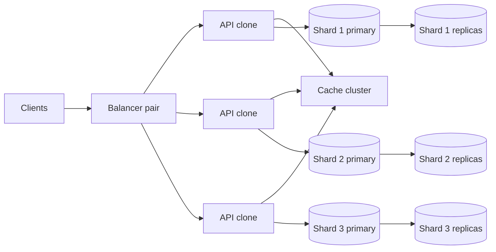

Horizontal scaling means adding machines that do the same work, not making one machine larger. In an interview that move only works on the parts that have no private state. You put clones behind a balancer. You leave the data that cannot be copied on a primary, or you shard it. Vertical scaling, a bigger box, is often the first move. Say both, in that order, and the drawing is easy.

## Adding clones behind a balancer

A clone is a process that can take any request in a class. It holds no private session and no unique row. It reads and writes shared state. Two clones are interchangeable. That is the test.

A client hits one address. A load balancer picks a healthy clone. The next request can land on a different clone. [Load balancing for system design interviews](/blog/load-balancing-for-interviews) is how that pick works. Round robin fits equal clones and equal requests. Least connections fits work that holds a worker. Health checks remove a dead clone.

This is the stateless tier. API servers that validate a body and call a store belong here. Queue workers whose job record lives in the queue belong here. Feed builders that write a shared list belong here. The process can die. Another continues. When load rises you add a clone, and a balancer pair if you do not already have one. DNS or anycast can sit in front so one balancer dying is not an outage. The client's URL does not change. That sentence is the gain you should say out loud.

Clones fail when you cheated on state. A session in the process needs sticky routing. A dead clone then loses sessions. A local cache that is the only copy of a feed is a shard you did not name. Put the session in a shared store. Put the list in a cache cluster. Layer-4 connection pinning is not application state. The next socket can go elsewhere.

Scale clones from a number you can redo. If one clone handles about 1,000 simple requests per second, 10,000 requests need about ten clones plus headroom for a deploy and a death. The balancer is not the hard part at that size. The store behind the clones is usually the real limit. Name that store before you add the eleventh API box. The clones are the easy half.

## The data that refuses to clone

Some data has one owner. A primary key on `code`. A sequence that mints ids. A leader that takes writes for a shard. Two writers on that object are not clones. They race.

Replication is not horizontal scaling of writes. Three replicas of one primary still have one write path. They add reads and a failover. [Database partitioning explained simply](/blog/database-partitioning-explained) draws the line. A replica copies rows you already have. A partition stores a different slice. Only the partition raises write throughput for distinct keys.

Name the objects that refuse to clone before you draw more boxes. An unsharded primary takes every write. More API clones pile queries onto it until CPU or locks give out, then more clones make it worse. A single-node cache still holds the viral key on one process. Replicas help reads. They do not add a second writer for that key. A local lock that says "I own this job" cannot be cloned. Put the lease in a shared store. A websocket holds one socket on one server. Add servers for new sockets and a pub/sub path so a message can find the holder. A single-process counter will issue the same ids from two clones. Split the id space or share the counter.

Three honest options. Leave it on one bigger box. Shard it so each piece has one owner. Change the product so two writers cannot touch the same object. "Add more database servers" without one of those is not a design.

## Vertical scaling as the first move

Vertical scaling is a larger machine. More CPU, RAM, disk, or network. The software stays one process or one primary. Failover is still one primary at a time.

I pick this first when the load still fits one box. One primary with replicas is simpler than a shard map. One cache node is simpler than a ring. One API host is enough to prove the path. The interview is a contest to name the first limit, not to draw the most boxes. That limit is usually memory or write I/O on the store, not the API. A shortener at tens of writes per second and thousands of cached reads fits one primary. The URL shortener capacity work on this site lands there. Clone the API. Do not shard the links table yet. Vertical scaling of the primary, plus replicas for reads and failover, is the rest.

Vertical scaling fails when the working set or the write rate leaves the biggest machine you will run, or when one machine is an unacceptable failure domain. A shard map costs complexity. Do not pay it to look distributed.

Upgrade path. One API and one primary. Clone the API when request CPU rises. Add a cache when primary reads rise. Give the primary more RAM while the working set fits. Shard when it does not, or when writes no longer fit one writer. A bigger API box that still holds sessions is the wrong upgrade. Take the sessions out, then clone.

| Move | What you add | What must be true |
| --- | --- | --- |
| Vertical | CPU, RAM, disk on one node | One address, one writer, one working set. |
| Horizontal | Another node doing the same role | No private state, or a shard key that splits ownership. |

They are not rivals. Vertical buys time. Horizontal buys a second machine when time runs out. Use both in one design. The order is the answer, and the first limit is the one you name out loud.

## Shard, then clone the stateless tier

Shard the data that has a single owner. Then keep cloning the stateless tier in front of it.

Sharding without that tier gives you N sticky primaries and clients that must know the map. Put a stateless API in front. The client still hits one balancer. [Database partitioning](/blog/database-partitioning-explained) is the post for the key and the hot key. This section is the order.

Pick a key that matches the lookup. Links on `code` if every read is a point lookup on the code. Feeds on `user_id` if every read is one user's list. Users and orders often share `user_id` so a user's rows stay together. A celebrity author is a hot key on a table sharded by author. Pull those accounts at read time instead of writing millions of rows to one partition.

Each shard is a small primary with replicas. You did not clone the writer for a given key. You reduced how many keys it owns. Writes for different keys now run in parallel. Ten API clones can talk to three shards. Twenty clones can talk to the same three. Clone count follows request CPU. Shard count follows data size and write rate. Do not add shards because the API is busy. Do not add API clones because one shard is hot.

Resharding is the cost you name. Adding a shard moves rows. Consistent hashing or a slot map limits how many keys move. The API clones stay up if they refresh the map. Users on a moving key see a short inconsistency or a retry. Say which. Cloning an API process has no such move. That is why you clone first and shard later. A cache cluster is the same split. The API hashes the key and goes to the right node. The cache node still refuses to clone that key. Two writers for one cache key need a primary per slot, the same as the database.

## A drawing that shows both

Draw the two axes on one picture. Left to right is the request. Top to bottom is the thing you cannot clone.

The balancer and the API boxes are clones. Any healthy API can take the request. Adding `A4` does not move a row. Removing `A2` does not lose a session if the session lives in the cache or the store.

The shards are not clones of each other. `Shard 1` does not hold `Shard 2`'s keys. The API uses the key to pick. Replicas under a shard are copies. They do not add a second write owner for that key.

A first version of the same picture has one primary instead of three shards. The API clones are already there. The cache may already be there. That primary is the box you can still enlarge. That is the vertical first move. When it is the limit, it splits into the three shards. The left side of the picture does not change.

An API clone dies. The balancer stops sending to it. The next request succeeds elsewhere. A shard primary dies. Other shards keep taking writes. Keys on the dead shard wait for failover. That difference is why the shards are not clones. Requests double: add API clones. Data and writes double: add a shard and move keys. Do not add clones to fix a hot primary. Do not add shards to fix a slow handler.

The picture is the answer. Horizontal scaling of compute is clones behind a balancer. Horizontal scaling of data is partitions with one writer each. Vertical scaling is the bigger box until one of those two is required. Put the three sentences under the drawing. Walk a growth step on each axis before you sit down. Requests double, add API clones. Data and writes double, add a shard. Never swap those two moves.

Drill the balancer and the shard key on the [fundamentals study page](/study/fundamentals). Run load balancing until clones need no sticky sessions. Run sharding until a hot key and a replica are different stories. Start that loop from [/study](/study).
