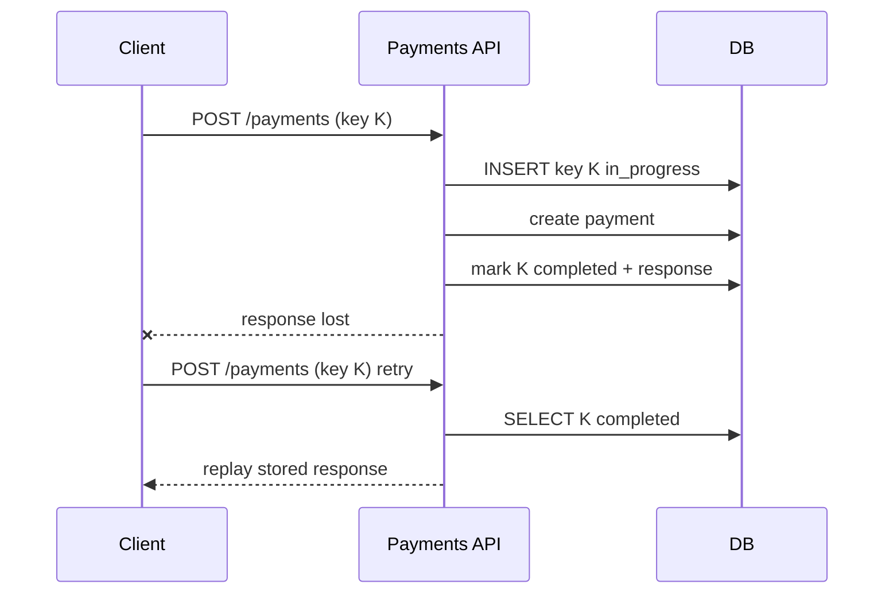

An operation is idempotent when doing it twice leaves the same result as doing it once. A retry of a payment is not naturally idempotent, so the client sends an idempotency key and the server stores the outcome under that key. Idempotency keys name one intent. This post walks the stored row, a lost response, the in-flight race, and expiry.

## Why the retry creates a second charge

A client calls `POST /payments` with an order id, an amount, a currency, and a payment method token. The server charges the customer. The server writes a payment row. The server returns `201` with a payment id and a state. The network drops that response. The client hits its timeout.

The client cannot tell a lost success from a failed charge. A careful client sends the request again. The server treats that second call as a new create. The customer pays twice for one order.

That double charge is the problem. A create changes the world on every accepted call. `POST` asks the server to do the work. The method does not remember that the work already happened.

A second read of the payment returns the same payment. A second create adds a second charge. `POST /payments/{id}/refunds` carries an idempotency key. A retried refund then moves the money once.

Any create that must happen once has this hole. A lost response can insert two orders. Practice this on a payment. The doubled effect is money. Name the lost response before you name the table.

## What the client sends and what the server stores

The client generates one idempotency key per logical operation. A UUID is enough. The intent "pay invoice 42 for account 17" gets one key. Every retry of that intent sends that key. A new intent gets a new key. The client sends the key on `POST /payments` in the `Idempotency-Key` header.

The server inserts a row before it does any work. The table is `idempotency_keys`. The primary key is `(account_id, key)`. The row stores a status and a hash of the request body. The first attempt sets the status to `in_progress`. The response is empty. The hash lets a later call prove it carries the same body.

The insert is atomic. The database accepts one insert for that account and that key. Any other insert conflicts. The conflict is how a duplicate learns that the operation already has a row.

The conflict has three shapes.

- The stored body hash differs from the new body. The server returns `422`. The client reused a key for a different request. That reuse is a client bug.
- The status is `completed`. The server returns the stored response. The status code is the one from the first attempt. The body is the one from the first attempt.
- The status is `in_progress`. The first request has not finished. The server returns `409` with a `Retry-After` header. Or the server waits briefly on the row lock. It then returns the completed result.

When the insert succeeds, this call is the first attempt. The server does the work. The server then stores the response on the row. It sets the status to `completed`. When the business write is a row in the same database, commit that write in the same transaction as the status update. A crash then cannot leave a finished payment beside a key that is still `in_progress`.

## A timeline you can redraw

Account `17` pays order `42`. The amount is `2500` minor units of USD. Amounts are integers in minor units. The payment method is a token the checkout already holds. The client mints one UUID and keeps it for this intent.

The key is `7c1a0e44-2b19-4f6a-9d30-1a8e5b6c7d90`. Call it `K`. Call the hash of this body `h1`.

At 10:00:00.000 the client sends the request.

```text
POST /payments
Idempotency-Key: 7c1a0e44-2b19-4f6a-9d30-1a8e5b6c7d90
{ orderId: "42", amount: 2500, currency: "USD", paymentMethodToken: "token-9" }
```

At 10:00:00.020 the insert commits. This is the first attempt. The stored row is the one below.

| account_id | key | status | body_hash | response |
| --- | --- | --- | --- | --- |
| 17 | K | in_progress | h1 | empty |

The server calls the payment provider only after that row is durable. The server passes its own idempotency key on the downstream call. At 10:00:00.450 the provider has accepted the charge. One transaction then writes the payment row and marks the key completed. The row now holds the outcome.

| account_id | key | status | body_hash | response |
| --- | --- | --- | --- | --- |
| 17 | K | completed | h1 | 201, payment id 88, state succeeded |

At 10:00:02 the client times out. The server had already finished. The `201` never reached the client. The client still holds `K` and the original body. The client sends `K` again. A fresh UUID would name a new intent. A new intent would be a new charge.

At 10:00:02.100 the retry arrives with `K` and the same body. The insert conflicts. The stored hash is `h1`. The new hash is `h1`. The status is `completed`. The server does not create a second payment. The server does not call the provider. The server returns the stored `201`. The body names payment id `88` and state `succeeded`. The provider charged the customer once.

Point at the empty `in_progress` row. That row exists before the charge. The `completed` row is what the second request returns.



## Storing the key after the charge

Run the same clock with the insert moved to the end. This is the failure the store-before-effect step prevents.

At 10:00:00 the request arrives. No row exists. The server calls the provider first. At 10:00:00.400 the provider accepts the charge. At 10:00:00.420 the process dies. The server never inserted the key. The server never stored the response.

At 10:00:02 the client retries with `K`. The server finds no row. The insert succeeds. The server treats the retry as a first attempt. The server calls the provider again. The customer pays a second time. The late row records only the second charge. The first charge has no row.

A select-then-insert fails in a similar gap. The server looks up `(account_id, K)` and sees nothing. A second request runs the same lookup before the first insert commits. Both requests see an empty result. Both requests charge the customer. The atomic insert closes that gap. One insert wins. The loser takes a conflict branch. The loser does not start the work.

The row for `(account_id, K)` has to exist before the charge. A lost response can then find it. A concurrent duplicate can then see it. A key written only after the side effect leaves a gap. The charge has succeeded. The server holds no row for it.

## When the retry arrives in flight

The first request is still running. The row is `in_progress`. A retry arrives with the same key and the same body hash. The card asks this as a follow-up. The second request must not start a second charge.

At 10:00:00.000 request A inserts `in_progress` for account `17` and key `K`. At 10:00:00.050 request A is inside the provider call. At 10:00:00.080 request B arrives with `K` and the same body. B's insert conflicts. The status is `in_progress`. The row holds no response yet.

Two behaviors are valid. Say which one you picked.

The server can return `409` and a `Retry-After` header. B waits. Then B sends `K` again. At 10:00:00.450 request A marks the key `completed` with the stored `201`. B's later retry finds `completed`. It replays that `201`. B never called the provider.

Or the server can wait briefly on the row lock. Request A holds the lock until it marks the row `completed`. B is waiting on that lock. B then reads the completed row. B returns the stored response. A `409` keeps the request short. A short wait covers a retry that arrived early. B does no work of its own.

A crash in this window is sharper. The server finishes a side effect. It dies before it marks the key `completed`. The row stays `in_progress`. A retry that only waits will wait without end.

Give the `in_progress` row a lease. After the lease times out, a retry may re-run from a checkpoint. The other fix applies when the work is a local database write. Commit that write in the same transaction that marks the key `completed`. A crash cannot separate those two writes.

## The provider call outside the database

A payment provider sits outside your database transaction. Aborting that transaction does not undo a charge the provider already accepted. A timeout on the call does not tell you which outcome you got.

Store the key and the body hash before you call the provider. Pass your own idempotency key on that call. The provider's retries of that call stay safe. Your key stops the client from creating a second charge. The downstream key stops your retry from creating one.

The timeout is the unknown-outcome case. You asked for the charge. The socket died. You do not know whether the provider took the money. A blind second charge risks a double charge. Marking the payment failed risks an unpaid order.

Mark the payment `pending_unknown`. Resolve it by querying the provider with your reference. Or wait for the provider's webhook to settle the state. A reconciliation sweep catches anything still stuck. A daily compare checks your records against the provider. While the provider is down, hold the payment pending. Retry that attempt with the same key. Tell the customer the payment is still pending.

## Expiry, scope, and a body that does not match

Keys expire. Keep each row for 24 hours or more. The range to say out loud is hours to days. After the row is gone, a retry is a new operation. The insert succeeds. The server runs the work again.

Clients do not retry for days. A key kept through the next day still covers a real retry.

Scope every key by account. The primary key is `(account_id, key)`. Account `17` and account `18` can both send `K`. They receive two rows. Account `18` proceeds as a first attempt. Account `18` does not receive account `17`'s stored `201`. A global key would hand account `18` that stored response.

The last check is a reused key with a different body. The client sends `K` again for account `17`. The amount is now `2600` minor units. The new hash is `h2`. The stored hash is `h1`. The insert conflicts. The server returns `422`.

The server does not replay the old `201`. That replay would report success for a body you did not run. The server does not charge `2600` either. That charge would let one key mean two operations. The mismatch is a client bug. Leave the completed row unchanged.

State four facts every time you answer. The atomic insert comes first. The stored response is what a retry receives. The mismatch check is the `422`. The TTL is at least 24 hours. The key is scoped per account.

## Drill the store-before-effect step

Recognition is the failure mode in prep. You can nod at the diagram. You can still insert the key after the charge. Say the flow before you look at the back.

The prompt on the [idempotency keys card](/cards/idempotency-keys) asks you to design idempotency for a create payment endpoint. Client retries must never double-charge. The prompt also asks you to walk the request flow and the edge cases.

Say these points out loud.

1. The client generates a unique idempotency key per logical operation. It sends that same key on every retry.
2. The server atomically records the key before doing the work. A concurrent duplicate sees the row. It waits. Or it returns the in-progress result.
3. The server stores the final response against the key. It replays that response on a later retry.
4. The server rejects a reused key that arrives with a different request body.
5. Keys expire after a window of hours to days. Each key is scoped per account. Two customers never share a row.

Drill until you can place the store-before-effect step. On this timeline the step is the insert at 10:00:00.020. The status is `in_progress`. The hash is `h1`. The response is empty. The charge comes after that insert. The retry at 10:00:02.100 only reads the stored `201`. Swap the insert and the charge. The crash at 10:00:00.420 then produces a second charge.

The in-flight follow-up returns `409` with `Retry-After`. Or the server waits briefly on the row lock. The downstream follow-up passes your own key to the provider. An unknown result stays `pending_unknown`. You query the provider by your reference. Or you wait for a webhook. A blind second charge is the wrong resolution.

The grading loop is the subject of [System design interview flashcards that actually stick](/blog/system-design-interview-flashcards). [Spaced repetition for system design](/blog/spaced-repetition-for-system-design) covers why a missed store-before-effect step should come back the next day.

Drill this on the [fundamentals study page](/study/fundamentals) until the empty `in_progress` row is the first mark you put down. [Start drilling](/study/fundamentals).
