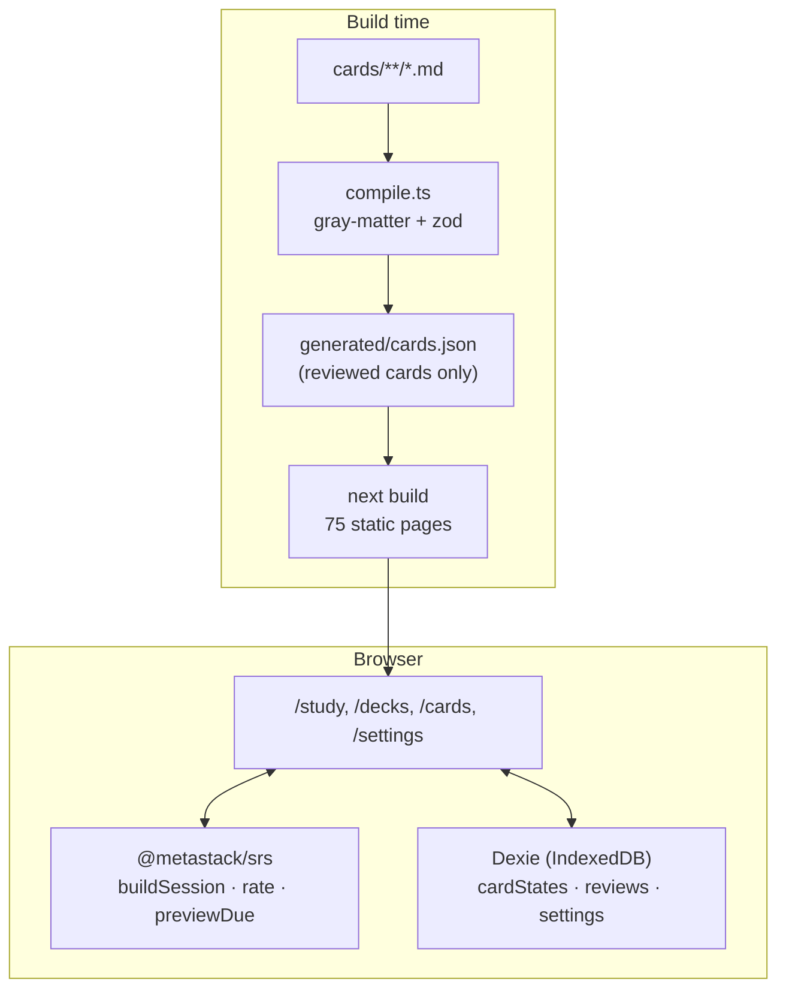

# Architecture

MetaStack is a static site plus a browser database. There is no server at runtime.

## Packages

### `packages/content`

- `cards/<deck>/<id>.md`: Markdown body with YAML front matter.
- `src/schema.ts`: zod schema, deck slugs, card types, tag vocabulary. The single source of truth for what a card is.
- `src/compile.ts`: reads a directory, validates every file, checks cross-file invariants (unique ids, id matches filename, deck matches folder, every deck non-empty).
- `scripts/compile.ts`: writes `generated/cards.json` containing only `reviewed: true` cards. Exits non-zero on any issue. Runs before `next dev` and `next build`.
- `src/index.ts`: imports the JSON and exposes typed accessors (`cards`, `getCard`, `cardsForDeck`, `tagCounts`). No filesystem access, so it is safe in the browser bundle.

### `packages/srs`

A thin, pure wrapper around `ts-fsrs`. All state is a plain JSON-serialisable `CardState`; dates are ISO strings. Key functions:

| Function                                                        | Purpose                                                                                |
| --------------------------------------------------------------- | -------------------------------------------------------------------------------------- |
| `createCardState(cardId)`                                       | New card, never reviewed                                                               |
| `rate(state, rating, now)`                                      | Apply a rating; returns the new state and a `ReviewRecord`                             |
| `previewDue(state, now)`                                        | Next due date for each of the four ratings, for button labels                          |
| `ratingFromRubric(hit, total)`                                  | `<40%` Again, `40–69%` Hard, `70–94%` Good, `≥95%` Easy                                |
| `buildSession({cardIds, states, newLimit, newIntroducedToday})` | Due cards first (oldest due first), then new cards up to the remaining daily allowance |
| `countDeck(cardIds, states)`                                    | `{total, due, new, learned}` for deck pickers                                          |

Parameters: target retention 0.9, maximum interval 180 days, fuzz disabled so tests are deterministic. 100% coverage is enforced.

### `apps/web`

Next.js 16 App Router, fully static. Pages are server components that read from `@metastack/content`; anything touching IndexedDB is a client component.

- `lib/db.ts`: Dexie schema (`cardStates`, `reviews`, `settings`), export/import, daily new-card counting (local day).
- `components/study/session.tsx`: the drill loop. Loads states for the current card set, builds the queue, handles reveal/rubric/rate, keyboard shortcuts, end-of-session summary, and the "study more" path that bypasses the daily limit.
- `components/markdown.tsx` + `mermaid-block.tsx`: react-markdown with GFM; Mermaid fences are rendered client-side with a lazily loaded Mermaid bundle, themed to match light/dark.
- Theme is a `data-theme` attribute set by an inline script before paint; the toggle writes `localStorage`.

## Key flows

**Session build.** `/study` passes all card ids; `/study/[deck]` passes that deck's ids. The client reads matching `cardStates`, counts how many new cards were introduced today (reviews whose `previousState` was `new` and whose `reviewedAt` is today), and calls `buildSession`. The queue is due cards sorted by due date, then shuffled new cards up to `newLimit - introducedToday`.

**Rating.** In rubric mode the suggested rating comes from ticked key points; the user can accept with Enter or override. `rate` produces the new state and a review record; both are written in a single Dexie transaction.

**Export/import.** A versioned JSON envelope (`app`, `version`, `exportedAt`, `cardStates`, `reviews`, `settings`). Import validates the envelope and replaces local data.

## Durable state and schema changes

The only durable state is the user's IndexedDB. It has a version history and the rules are:

- `db.version(1).stores(...)` in `lib/db.ts` is the baseline. It is never edited.
- A schema change is a new `db.version(n + 1).stores(...)` with an `upgrade()` function that transforms existing rows. Dexie applies versions in order and the browser serialises upgrades, so no lock is needed.
- The export envelope's `version` is bumped with any change to its shape, and `importData` must accept every previous version it has ever written, or reject it with a message that says so.
- Card ids are stable. Renaming a card id is a schema change for the user's data and needs an upgrade step that rewrites `cardStates.cardId` and `reviews.cardId`.

## Verification

How the checks are wired, and why each is shaped the way it is, is in [ENGINEERING_PRACTICES.md](ENGINEERING_PRACTICES.md). In short: nine named CI jobs are required on `main`; hooks only format staged files at commit and run typecheck plus the production build at push; every hand-written check ships with a test that proves it can fail; nothing required touches the network.

## Decisions

See the ADRs in [`docs/adr`](adr):

- [0001 Static first, no backend](adr/0001-static-first.md)
- [0002 FSRS over SM-2](adr/0002-fsrs-over-sm2.md)
- [0003 Markdown + front matter for content](adr/0003-markdown-content.md)
- [0004 Monorepo layout](adr/0004-monorepo-layout.md)
