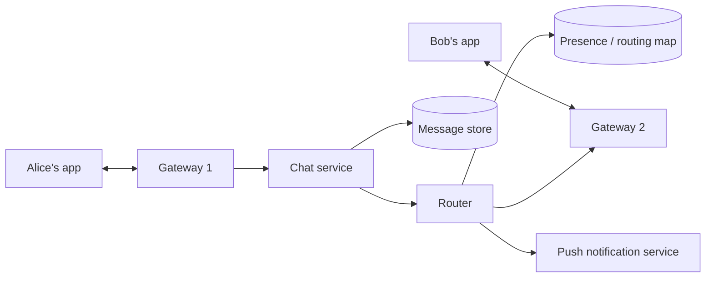

## Requirements

Send and receive messages in 1:1 and group conversations with delivery and read receipts; show presence (online, last seen); sync history across a user's devices; notify offline users. Online delivery should feel instant (under 100 ms in-region), nothing may be lost, and messages within a conversation must appear in the same order for everyone.

## Estimates

500 million DAU × 40 messages ≈ 2 × 10^10 messages/day ≈ 230,000/s average, ~600,000/s peak. With ~3 recipients per message, ~2 million deliveries/s at peak. 10–20% online at once → 50–100 million persistent connections. Text storage ~4 TB/day; media (via object storage) 100× that.

## API

A WebSocket (or similar) channel carries `send`, `ack`, `receipt`, `typing` and `presence` frames. REST endpoints cover `GET /conversations`, `GET /conversations/{id}/messages?before=`, `POST /media/upload-url`. Clients attach a locally generated message id to each send so retries are idempotent.

## Data model

`messages` partitioned by `(conversation_id, time_bucket)` and clustered by `message_id`, so "load the last 50 messages in this chat" is one partition read in time order. `conversations(id, type, created_at)`, `members(conversation_id, user_id, joined_at, last_read_message_id)`. A presence/routing map `user_id → { gateway_id, device_ids, last_seen }` in Redis.

## High-level design

Alice's gateway forwards her message to the chat service, which validates membership, assigns a server-side message id and timestamp, persists it, and hands it to the router. The router looks up each recipient's gateway and pushes the message; recipients not connected get a push notification and will fetch on reconnect. Alice's gateway returns an ack with the server id so her client can mark it "sent".

## Deep dives

**Ordering.** Assign ids per conversation from a single writer (a per-conversation sequencer or the partition owner) so every client sorts by the same id. Time-ordered ids (Snowflake) are a reasonable approximation when strict per-conversation sequencing is too costly.

**Group fan-out.** For groups up to a few hundred members, the router expands membership and pushes to each. For huge channels (tens of thousands), pushing is wasteful; instead notify members that the channel has new messages and let clients pull when the channel is open, Slack-style.

**Sync across devices.** Each device tracks the last message id it has seen per conversation and requests everything newer on reconnect. Because history is in a partitioned store keyed by conversation and time, this is a cheap range read.

**Presence.** Clients heartbeat every ~30 s; the gateway updates `last_seen`. Friends subscribe to presence changes through a pub/sub channel; publish only on transitions, not on every heartbeat.

## Bottlenecks and failure modes

- **Gateway crash:** tens of thousands of clients reconnect at once. Use jittered reconnect and let them resync from last acked id; nothing is lost because messages are persisted before delivery.
- **Hot conversation:** a 50,000-member group is a hot partition for writes and a fan-out storm for reads; the pull model for large channels and time-bucketing the partition key handle it.
- **Duplicates:** at-least-once delivery means a client may see a message twice; dedupe by message id.
- **Media:** never through the chat path. Upload to object storage via presigned URL, send a message containing the reference.
