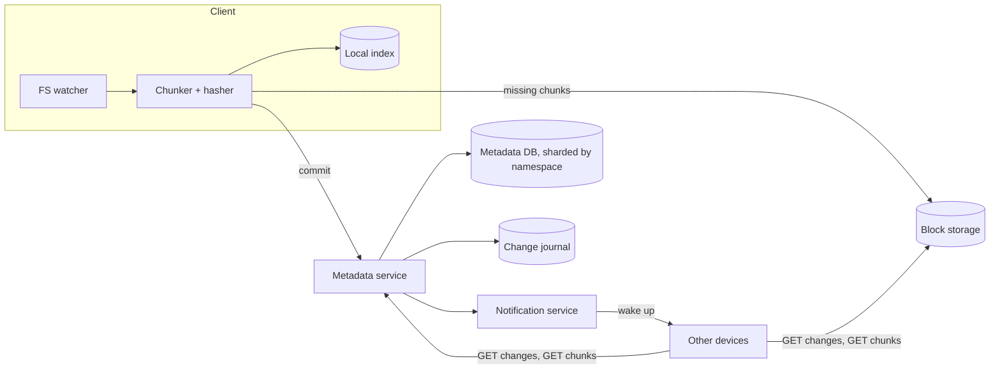

## Requirements

A user installs a client on several devices; any file saved into the synced folder appears on the others within seconds. Files can be gigabytes; bandwidth and storage should be used efficiently; edits made offline must reconcile without losing anything; users can view history and share folders. Durability must be essentially perfect.

## Estimates

100 million users with ~200 files averaging 500 KB is ~10 PB of logical data. Deduplication (the same installer, the same photo forwarded around) cuts that meaningfully; replication or erasure coding multiplies it back. Request volume is dominated by small metadata operations (listing changes, committing versions), not bytes.

## API

```text
GET  /namespaces/{ns}/changes?cursor=...      -> [{ path, version, chunkHashes[], deleted }], nextCursor
POST /namespaces/{ns}/commit                  { path, parentVersion, size, chunkHashes[] } -> { version } | 409 conflict
POST /chunks/presign                          { hashes[] } -> { missing: [{ hash, uploadUrl }] }
PUT  <presigned chunk URL>                    (raw bytes)
GET  <presigned chunk URL>
```

## Data model

`files(id, namespace_id, path, version, size, chunk_hashes[], modified_at, modified_by_device, deleted)` plus an append-only `journal(namespace_id, seq, file_id, version)` that clients page through by cursor. `chunks(hash PK, size, storage_key, refcount)` enables dedup. Namespaces are a user's root or a shared folder, and are the sharding unit.

## High-level design



A device detects a change, chunks the file, asks which chunk hashes the server lacks, uploads only those, then commits the new file version. The server validates the parent version, appends to the journal and pings the user's other devices, which fetch the change list and download missing chunks.

## Deep dives

**Chunking.** Fixed-size chunks break on inserts: adding one byte at the start shifts every boundary. Content-defined chunking uses a rolling hash to place boundaries at content patterns, so an edit only changes the chunks around it. Chunk hashes (SHA-256) are the content addresses used for dedup and integrity.

**Conflicts.** Each commit carries the `parentVersion` the client based its edit on. If the server's current version differs, another device committed first; the server rejects with `409`, and the client saves its version as `report (conflicted copy from laptop).docx` and commits that as a new file. No data is ever lost; the user merges manually. Version vectors can refine this for multi-master offline edits.

**Dedup and GC.** Chunks are shared across files and users via refcounts. Deleting a file decrements counts; a background collector removes chunks whose count hits zero after a grace period (so a quick undelete is free).

**Notifications.** Long polling per namespace works well: a device holds a request open; when the journal for any of its namespaces advances, the server responds and the device syncs. WebSockets are an alternative, but long polling survives corporate proxies better.

## Bottlenecks and failure modes

- **Metadata hot spots:** a user with millions of files makes listing and journal reads heavy; paginate aggressively and shard by namespace.
- **Large-file uploads:** resumable by design, because a retry asks "which chunks are missing" and uploads only those.
- **Notification storms:** a shared folder with 10,000 members gets one change → 10,000 wakeups; batch notifications and let clients debounce.
- **Clock and ordering:** never use client timestamps for conflict decisions; use server-assigned versions.
- **Durability:** chunks are immutable, which makes replication and verification simple; periodically re-hash stored chunks to detect bit rot.
