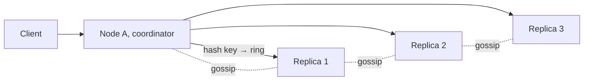

## Requirements

A store exposing `get`, `put` and `delete` on opaque keys with values up to about a megabyte. It must scale by adding commodity nodes, keep serving reads and writes when nodes fail or the network partitions, offer single-digit-millisecond latency, and let callers choose between stronger consistency and lower latency per request.

## Estimates

100 TB of logical data at replication factor 3 is 300 TB on disk. With 2–4 TB usable per node (leaving room for compaction), that is 100–150 nodes. One million operations per second across the cluster is ~10,000 per node, which an LSM-based node handles comfortably.

## API

```text
put(key, value, context?) -> ok
get(key, consistency=QUORUM) -> [{ value, version }]   // may return siblings
delete(key)
```

`consistency` is `ONE`, `QUORUM` or `ALL`, trading latency and availability for recency.

## Data model

Keys and values are bytes. Each stored value carries a version (vector clock or timestamp), optional TTL, and a tombstone flag for deletes. Cluster metadata holds the ring (token ranges per node) and the replication factor.

## High-level design



Any node can coordinate. It hashes the key onto the ring, identifies the N replicas (the next N distinct nodes clockwise), sends the request to all, and responds once W (writes) or R (reads) have acknowledged. Membership and liveness spread by gossip; each node runs a failure detector.

## Deep dives

**Partitioning.** Consistent hashing with virtual nodes: each physical node owns many small token ranges, so adding a node pulls a sliver from everyone and a failed node's load spreads across the cluster rather than onto one neighbour.

**Quorums.** With N = 3, W = 2, R = 2, every read overlaps every successful write on at least one replica. W = 1 gives the fastest, most available writes at the cost of possibly reading stale data; W = 3 makes writes fail if any replica is down. Expose this per request.

**Conflicts.** Under availability-first writes, two replicas can accept different values for the same key. Vector clocks (one counter per coordinator) let the store detect concurrency and hand both versions ("siblings") back to the client to merge; shopping carts are the classic example. Last-writer-wins by timestamp is simpler and what most deployments choose, accepting silent loss on true conflicts.

**Repair.** *Read repair* writes the newest version back to stale replicas on each read. *Anti-entropy* compares Merkle trees between replicas in the background and streams differing ranges. *Hinted handoff* keeps a write destined for a down replica on another node and delivers it when the replica returns.

**Storage engine.** Writes append to a commit log and an in-memory memtable; memtables flush to immutable sorted files (SSTables). Reads check the memtable, then SSTables newest-first, skipping files whose Bloom filter says the key is absent. Compaction merges SSTables and drops tombstones.

## Bottlenecks and failure modes

- **Node loss:** replicas keep serving; a replacement node streams its ranges from peers.
- **Hot keys:** one celebrity key overwhelms its three replicas; cache at the client or salt the key into several sub-keys.
- **Latency spikes:** compaction I/O and JVM-style pauses show up at p99; throttle compaction and size heaps carefully.
- **Tombstone accumulation:** heavy deletes slow reads until compaction; set `gc_grace` thoughtfully.
- **Split brain:** without a leader there is none to split, but a partitioned minority will accept writes that must be reconciled later; that is the chosen tradeoff and you should say so.
