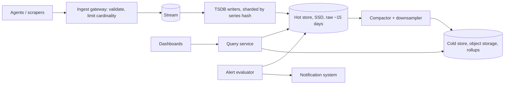

## Requirements

Collect numeric metrics (CPU, request latency, queue depth, business counters) from tens of thousands of hosts and services. Engineers query them over time ranges with aggregation (sum by service, p99 by region) for dashboards, and define alert rules ("error rate > 1% for 5 minutes") that notify on-call. Ingest is millions of points per second; recent-data queries must return in under a second; retention is years, at decreasing resolution.

## Estimates

100,000 hosts × 100 series × one sample per 10 s = **1 million samples/s**. A raw sample (timestamp + float64) is 16 bytes → 16 MB/s, ~1.4 TB/day. Gorilla-style compression gets this to ~1–2 bytes per sample, so ~100–200 GB/day of hot storage, and downsampled tiers are a fraction of that. Series count (10 million here) matters as much as sample rate, because every series needs an index entry and an open write buffer.

## API

Ingestion either pushes (`POST /write` with batches of `name{labels} value timestamp`) or pulls (the system scrapes `/metrics` endpoints on a schedule). Queries use a language with selectors and functions (`rate(http_errors_total{service="api"}[5m])`), range and instant queries, and aggregation operators. Alert rules are stored expressions with a duration and severity; dashboards are saved query layouts.

## Data model

A series is identified by its name and sorted label pairs; hash them to a series id. An inverted index maps each `label=value` to the set of series ids so queries like `service="api"` resolve to series quickly. Samples are stored in time-partitioned blocks (say two hours) per series, compressed. Downsampled tiers store per-interval `count, sum, min, max` (and sketches for percentiles) with their own retention.

## High-level design

## Deep dives

**Compression.** Timestamps in a series arrive at near-regular intervals, so store the delta of deltas, which is usually zero and encodes in a bit or two. Values change slowly, so XOR each with the previous and store only the differing bits. Gorilla reported ~1.37 bytes per sample with this, enabling weeks of data in memory.

**Downsampling and retention.** A background job reads raw blocks and writes 1-minute and 1-hour rollups. Policies such as raw for 15 days, 1-minute for 90 days, 1-hour for 2 years keep storage bounded. Queries over long ranges automatically read the coarsest tier that satisfies the requested resolution.

**Cardinality control.** A label like `user_id` turns one metric into millions of series and sinks the index. Enforce per-tenant series limits at the gateway, reject or drop high-cardinality labels, and surface the top offenders so teams fix instrumentation.

**Alerting independence.** Evaluators run rules every N seconds against the hot store, keep state for "for 5 minutes" conditions, and hand firing alerts to the notification system with grouping and deduplication. Keep this path small and separate from dashboard queries so a heavy ad hoc query cannot delay a page.

## Bottlenecks and failure modes

- **Ingest spikes** (a deploy restarts everything at once): the stream absorbs the burst; writers catch up.
- **Query abuse:** an unbounded `rate(...)` over a year across all series must be refused or chunked; apply query limits and cache panel results.
- **Writer failure:** series are sharded across writers with replication; a lost writer's shards are replayed from the stream.
- **Self-monitoring:** the metrics system must not depend on itself; run a tiny independent monitor that alerts if ingestion stops.
- **Clock skew:** samples with far-future or far-past timestamps are rejected to protect block boundaries.
