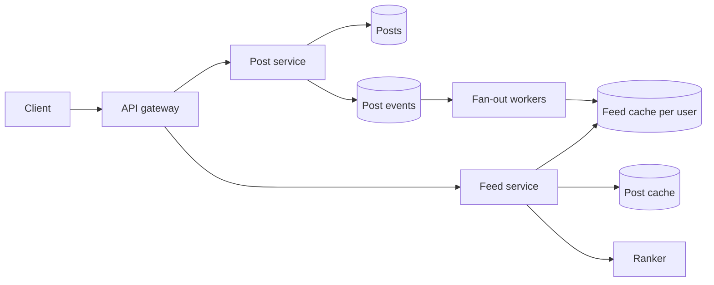

## Requirements

Users publish posts (text plus optional media), follow other users, and open a feed showing posts from people they follow, newest first or ranked. The feed must load in well under a second and a new post should appear for followers within a few seconds. Reads vastly outnumber writes.

## Estimates

Take 300 million DAU, 2 posts/user/day → 6 × 10^8 posts/day ≈ 7,000 posts/s. Ten feed opens per user per day → 3 × 10^9 reads/day ≈ 35,000 feed reads/s, ~100,000 at peak. With an average of 200 followers, pushing every post to every follower is 7,000 × 200 = 1.4 million feed-cache writes per second. That number is why the design has a decision to make.

## API

```text
POST /posts            { text, mediaIds[] }          -> { postId }
GET  /feed?cursor=...  -> { items: [post...], nextCursor }
POST /users/{id}/follow
```

## Data model

`posts(id, author_id, text, media_refs, created_at)` sharded by post id (Snowflake ids encode time, making recent-post scans cheap). `follows(follower_id, followee_id)` indexed both ways: "who do I follow" and "who follows me". The **feed cache** is per user: a sorted list of `(post_id, score)` capped at a few hundred entries, in Redis sorted sets or a wide-column table.

## High-level design



Writing a post stores it and emits an event. Fan-out workers look up the author's followers and insert the post id into each follower's feed list. Reading a feed fetches the user's list, hydrates the post objects from a post cache, ranks them, and returns a page with a cursor.

## Deep dives

**Fan-out on write vs on read.** Push (precompute every follower's feed) makes reads a single cache lookup but costs writes proportional to follower count. Pull (at read time, fetch recent posts from every followee and merge) makes writes trivial but reads expensive for users who follow many accounts. The hybrid: push for authors under a threshold (say 10,000 followers), and for celebrities above it do not fan out; instead the feed service pulls their recent posts at read time and merges them into the precomputed list. Twitter described exactly this split.

**Feed storage.** A sorted set per user keyed by post id with a score of creation time (or rank). Trim to the newest 500 on insert. Memory: 300M users × 500 entries × ~16 bytes ≈ 2.4 TB across a cache cluster, acceptable; skip inactive users to cut it.

**Ranking.** Keep retrieval and ranking separate. Retrieval returns a few hundred candidates; a ranking service scores them with features (recency, author affinity, engagement velocity) and the client shows the top N. If the ranker is slow or down, fall back to chronological.

**Own posts.** Insert the author's own post into their feed synchronously so they see it immediately; everyone else can wait a few seconds.

## Bottlenecks and failure modes

- **Celebrity storms:** handled by the pull path above.
- **Inactive users:** fan-out to someone who has not opened the app in a month is wasted work. Skip them and rebuild their feed by pulling when they return.
- **Feed cache loss:** rebuild lazily on read from followees' recent posts; degrade to chronological pull.
- **Hot posts:** engagement counters (likes, comments) on viral posts are a write hotspot; aggregate them asynchronously and cache them separately from the post body.
