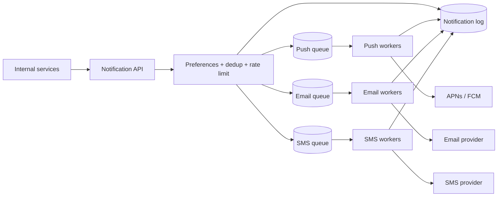

## Requirements

Internal services (orders, social, security) ask the notification service to tell a user something. The service chooses channels based on the user's preferences and the notification type, renders content, delivers through third-party providers, retries failures, avoids duplicates, respects quiet hours and rate limits, and records delivery status. Transactional notifications (login codes, payment receipts) must be fast and reliable; marketing can wait.

## Estimates

Say 10 million push, 1 million email and 100,000 SMS per day: tens to a few hundred per second on average, but events like "your favourite team scored" create bursts of tens of thousands per second. Each notification logs ~1 KB → ~10 GB/day, keep 90 days.

## API

```text
POST /v1/notifications
{ userId, type: "order_shipped", data: {...}, channels?: [...], priority: "high"|"normal"|"low", idempotencyKey }
-> { notificationId, status: "queued" }

GET  /v1/notifications/{id}
GET/PUT /v1/users/{id}/preferences
```

## Data model

`devices(user_id, platform, token, last_seen)`, `contacts(user_id, email, phone, verified)`, `preferences(user_id, type, channel, enabled, quiet_hours)`, `templates(type, channel, locale, body)`, and a `notification_log(id, user_id, type, channel, status, provider_message_id, created_at, delivered_at, error)`.

## High-level design



The API validates the request, checks the idempotency key, resolves the user's channels from preferences, writes a log row per channel with status `queued`, and enqueues one message per channel. Channel workers render the template in the user's locale, call the provider, and update the log. Failures retry with exponential backoff; after N attempts the message goes to a dead-letter queue for inspection.

## Deep dives

**Provider abstraction.** Each channel worker talks to an interface (`send(message) → providerId | error`) with multiple implementations. Track per-provider error rates and latency; on degradation, shift traffic to a backup vendor automatically.

**Priorities.** Separate queues (or priority lanes) per urgency. A marketing blast of 5 million emails must never delay a 2FA code. Reserve worker capacity for the high-priority lane.

**Deduplication and rate limiting.** The idempotency key stops duplicate requests from the same producer. A per-user limiter ("at most 5 marketing pushes a day") and collapse keys ("replace the older 'new message' notification") stop fatigue. Digest mode buffers low-priority events and sends one summary per hour.

**Templates.** Store templates with placeholders; render at send time so copy changes do not need code deploys, and version them so the log can show exactly what was sent.

## Bottlenecks and failure modes

- **Broadcast fan-out:** one event → millions of notifications. Expand the audience in a fan-out worker that enqueues in batches with throttling, rather than inside the API request.
- **Provider outage:** messages queue up; retries with backoff plus vendor failover. Monitor queue age, not just depth.
- **Invalid device tokens:** APNs and FCM report them; prune on feedback or every push wastes a call.
- **Provider rate limits:** SMS vendors throttle per number; shard sends across sender pools and respect their limits with a token bucket per provider.
