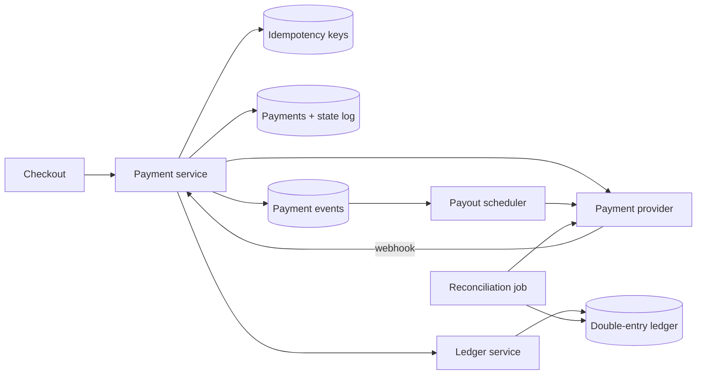

## Requirements

Customers pay for orders with cards or wallets; the platform holds funds and pays merchants out on a schedule; refunds and disputes flow back. Money must move exactly once, balances must be exactly right, every movement must be auditable, and card data should never touch the platform's servers. Throughput is modest; correctness is everything.

## Estimates

One million orders per day is ~12 payments per second average, perhaps a few hundred per second during a flash sale. Payouts are batched daily. This is a small system by volume, which is why the design spends its complexity on consistency and reconciliation rather than scale.

## API

```text
POST /payments
  Idempotency-Key: <uuid>
  { orderId, amount, currency, paymentMethodToken }
  -> 201 { paymentId, state: "pending" | "succeeded" | "failed" }

GET  /payments/{id}
POST /payments/{id}/refunds   Idempotency-Key  { amount }
POST /webhooks/psp            (signed events from the provider)
```

## Data model

`payments(id, order_id, amount_minor, currency, state, psp_reference, idempotency_key, created_at, updated_at)` with a `payment_events` log of every transition. A double-entry `ledger_entries(id, txn_id, account_id, debit_minor, credit_minor, currency, created_at)` table where each `txn_id` groups entries whose debits equal credits. Accounts include customer receivables, platform cash at PSP, merchant payable, fees and refunds. Amounts are integers in minor units; never floats.

## High-level design



## Deep dives

**Idempotency end to end.** Store the key and request hash *before* calling the PSP; on a repeat, return the stored outcome. Pass your own idempotency key to the PSP so their retries are safe too. Webhooks carry event ids; process each id once.

**The unknown-outcome problem.** The PSP call times out. Did the charge happen? Never retry blindly (that risks a double charge) and never assume failure (that risks an unpaid order). Mark the payment `pending_unknown`, then resolve by querying the PSP with your reference, or wait for the webhook, with a reconciliation sweep for anything stuck.

**Double-entry ledger.** Every money movement is a transaction with at least two entries whose debits equal credits: a customer payment debits "cash at PSP" and credits "merchant payable" and "platform fees". Entries are never updated or deleted; corrections are new entries. Balances are sums over entries (cached with a version for speed, recomputed for audits). This gives you an audit trail by construction and makes "where did the money go" a query.

**State machine.** `created → pending → succeeded | failed`, with `succeeded → partially_refunded → refunded` and `disputed` branches. The payment service is the only writer, and every transition is validated and logged.

**PCI scope.** The browser or app sends card details straight to the PSP, which returns a token. The platform only ever stores the token, keeping most of PCI DSS out of scope.

## Bottlenecks and failure modes

- **PSP outage:** accept the order, hold the payment as pending, retry with the same key, and tell the customer honestly. Consider a second PSP for failover, routed by BIN or region.
- **Duplicate webhooks and out-of-order events:** idempotent by event id; apply transitions only if valid from the current state.
- **Reconciliation gaps:** nightly compare your ledger against PSP settlement reports; every mismatch is an alert and a ticket with tooling to post correcting entries.
- **Refund after payout:** the merchant's payable goes negative; net it against future payouts or claw back per contract, all as ledger entries.
- **Hot merchant balance row:** many concurrent payments to one merchant contend on a cached balance; append entries freely and update the cached balance asynchronously or with optimistic versioning.
