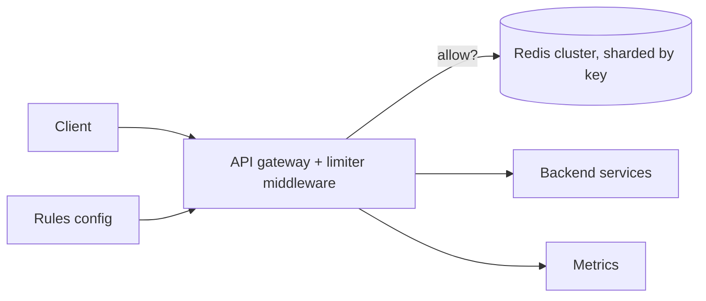

## Requirements

Enforce limits such as "1,000 requests per minute per API key" and "10 login attempts per hour per IP" consistently across every API server. Checks must add about a millisecond, the limiter must not become the outage, and clients need enough information to back off intelligently. Rules change without redeploys.

## Estimates

If the API fleet serves 100,000 requests/s, the limiter performs 100,000 checks/s. Each check is one small Redis command on one key, which a modest Redis cluster handles. With 10 million active keys at ~100 bytes each, counters take ~1 GB of memory.

## API

Internally the middleware calls `allow(key, rule) → { allowed, remaining, resetAt }`. Externally a rejected request gets `429 Too Many Requests` with `Retry-After: <seconds>` and `RateLimit-Limit`, `RateLimit-Remaining`, `RateLimit-Reset` headers on every response.

## Data model

Rules live in a config store and are cached in every server: `{ scope: apiKey | ip | user, endpoint pattern, limit, window, burst }`. Counters live in Redis keyed by `rl:{ruleId}:{clientKey}` with a TTL slightly longer than the window so idle keys disappear.

## High-level design

The gateway loads rules, hashes the client key to a Redis shard, and runs an atomic script. Allowed requests proceed; rejected ones return 429 immediately.

## Deep dives

**Token bucket in Lua.** Store `tokens` and `last_refill` in a hash. The script reads both, adds `rate × elapsed` tokens up to `capacity`, and if `tokens ≥ 1` decrements and returns allowed. One round trip, atomic, and the bucket's state is two numbers. Use Redis `TIME` inside the script so app server clocks do not matter.

**Sliding window counter.** Keep counts for the current and previous fixed windows. Estimate = `current + previous × (overlap fraction)`. Two integers per key and smooth behaviour at boundaries; slightly approximate, which is fine for API quotas.

**Local pre-limiting.** A single abusive client can generate more checks than Redis wants to see. Each server keeps a tiny in-memory limiter per key as a first filter and only consults Redis when the local limiter allows.

**Multiple rules.** A request may match several (per key, per endpoint, per IP). Evaluate all; reject if any fails; report the most restrictive remaining count.

## Bottlenecks and failure modes

- **Redis down.** Decide explicitly: fail open (serve traffic, protect yourself with a local backstop) for a bounded time with loud alerts, or fail closed for abuse-sensitive endpoints like login.
- **Hot shard.** One client key always hashes to one shard; if a single client is 20% of traffic, that shard is hot. Local pre-limiting and giving huge clients dedicated limits mitigate it.
- **Accuracy vs latency.** A central store is exact; local-only is fast but allows N× the limit across N servers. The hybrid (lease batches of tokens) is the usual production answer.
- **Observability.** Count throttled requests per rule and per client; a sudden rise usually means a client bug or an attack.
