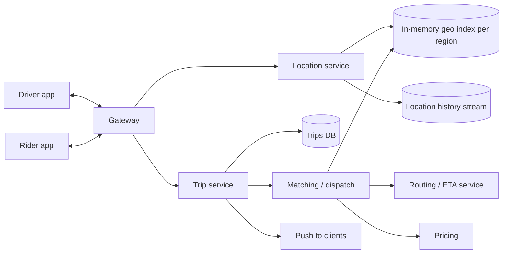

## Requirements

Drivers continuously report their location and availability. A rider enters pickup and destination and gets matched with a nearby driver within seconds. Both parties see each other's position live until pickup; the trip proceeds through states until completion and payment. The system must be highly available per city, and a driver must never be assigned two trips at once.

## Estimates

One million online drivers reporting every 4 seconds is **250,000 location writes per second**, far more than any relational database should see on a hot path. Trips are tiny by comparison (tens of thousands per minute worldwide). Reads for matching (nearby lookups) and tracking (riders polling or subscribed to one driver) are in the millions per second but local to a region.

## API

Drivers hold a persistent connection: they stream `location { lat, lng, heading, status }` frames and receive `offer { tripId, pickup, eta, expiresAt }` frames to accept or decline. Riders call `POST /trips { pickup, destination }` and subscribe to trip updates; `GET /trips/{id}` returns the current state, driver position and ETA; `POST /trips/{id}/cancel`.

## Data model

Live state lives in memory, partitioned by region: `driver:{id} → { cell, lat, lng, status, updatedAt }` and `cell:{h3} → set(driverIds)`. Durable state in a database: `trips(id, rider_id, driver_id, state, pickup, dropoff, requested_at, matched_at, started_at, ended_at, fare)`. Raw location history is appended to a stream for analytics and dispute resolution, not written to the trip database.

## High-level design

## Deep dives

**Geo index.** Convert each location to an H3 (or geohash) cell at a resolution around 0.5–1 km. Updating a driver means removing them from the old cell set and adding to the new one: two in-memory operations. Matching queries the pickup cell and its ring of neighbours, yielding tens of candidates, then computes exact distance and asks the routing service for ETAs.

**Dispatch.** Rank candidates by ETA (and acceptance history, fairness). Atomically set the best driver's status from `available` to `offered` (compare-and-set); if that fails, try the next. Send the offer with a 10–15 s expiry. On accept, transition the trip to `matched` and the driver to `on_trip`; on decline or timeout, release the driver and offer the next candidate. Every transition is idempotent and recorded.

**Trip state machine.** `requested → matching → matched → arriving → in_progress → completed | cancelled`. The trip service is the single writer for a trip; clients send intents, the service validates the transition.

**Regional sharding.** Matching is inherently local, so shard the live index, matching and gateways by city or region. Cross-region is only needed near borders; include neighbouring region cells in the query when the pickup is near an edge.

## Bottlenecks and failure modes

- **Location write volume:** in-memory, region-partitioned stores absorb it; sample to durable storage at a lower rate.
- **Double assignment:** the compare-and-set on driver status (or a single dispatcher process per cell group) is the invariant; say it explicitly.
- **Hot cells:** a stadium emptying creates thousands of requests in one cell; widen the search ring progressively and use surge pricing to rebalance supply.
- **Region failure:** replicate live state to a standby; on failover drivers reconnect and re-report location within seconds, so the index rebuilds itself.
- **ETA service slowness:** fall back to straight-line distance ranking rather than blocking matches.
