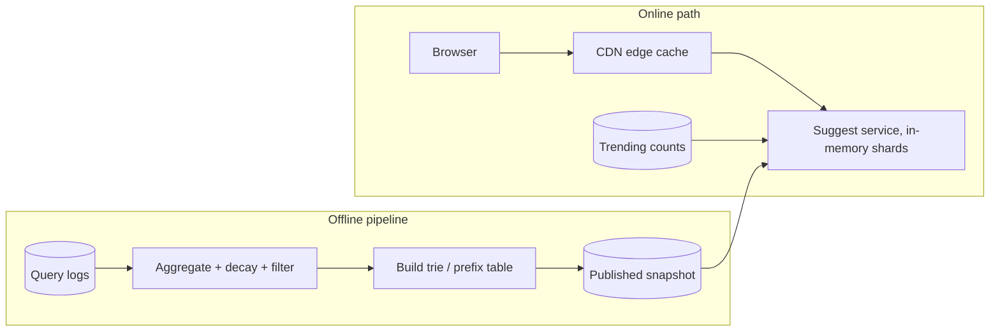

## Requirements

As the user types, show the ten most popular queries starting with what they have typed so far, ranked by popularity, with results arriving fast enough to feel instant (under 100 ms including network). Popularity should reflect recent behaviour, with hourly or daily refreshes and a faster path for trending terms. Offensive or private strings must never appear.

## Estimates

With 10 million searches/day and ~5 keystrokes per search, there are ~50 million prefix lookups/day: ~600/s average, peaks of a few thousand per second. If there are 100 million distinct queries and we store the top 10 completions for every prefix up to, say, 20 characters, the structure is tens of gigabytes: fits in memory across a small cluster.

## API

`GET /suggest?q=des&limit=10` returns `["design patterns", "design system", ...]`. Responses depend only on the prefix (no user state), so they cache perfectly at the CDN with a short TTL. The client debounces keystrokes (50–100 ms), cancels in-flight requests when a new key arrives, and caches results locally for backspacing.

## Data model

Two equivalent choices:

1. **Trie with per-node top-k.** Each node represents a prefix and stores its ten best completions with scores. Lookup walks the prefix (O(length)) and returns the stored list; no subtree traversal at query time.
2. **Flat key-value table** `prefix → [top-k]` for every prefix. Simpler to shard and serve from Redis or a wide-column store; costs more storage because prefixes repeat completions.

Both are built offline from an aggregated `query → weighted count` table where weights decay over time.

## High-level design

The offline job runs hourly, applies the blocklist, computes decayed popularity, builds the structure, and publishes a new snapshot. Serving nodes load the snapshot into memory with a double-buffer swap so no request sees a half-built structure.

## Deep dives

**Why precompute top-k.** Computing the top 10 completions under a trie node at query time means traversing possibly millions of descendants. Storing the answer at each node makes every lookup a few pointer hops; the cost moves to the build step, which is offline and parallel.

**Sharding.** Hash on the first character or two. "a", "s" and "t" prefixes are far hotter than "x" or "z", so split hot shards further (e.g. "a" → "aa"–"am", "an"–"az") and replicate every shard several times; the data is read-only so replication is trivial.

**Trending.** A streaming job counts queries over the last few minutes. The serving node merges a small trending list into results when a recent term's velocity exceeds a threshold, so "earthquake" appears within minutes rather than after the next hourly build.

**Personalisation.** Keep the global results cacheable and let the client (or a thin layer) re-rank or prepend the user's own recent searches, which it already has locally.

## Bottlenecks and failure modes

- **Hot prefixes:** single-letter prefixes dominate traffic; edge caching with a 60-second TTL absorbs most of it.
- **Snapshot publish:** load the new structure in the background and swap atomically; keep the old one until all requests using it finish.
- **Bad data:** blocklist at build time, plus a kill switch to remove a term from serving immediately without a rebuild.
- **Latency budget:** network ~30–50 ms, edge or service ~5 ms, client render ~10 ms. Most of the budget is the network, which is why the CDN matters more than the data structure.
