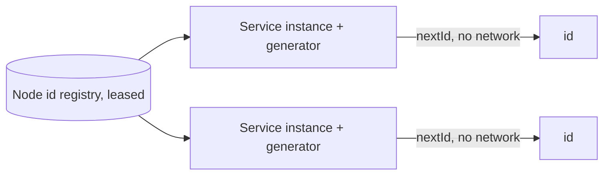

## Requirements

Ids must be unique across every datacenter, fit in a signed 64-bit integer (database-friendly), sort roughly by creation time so indexes and pagination work well, and be generated at millions per second with microsecond latency. No central service may be on the critical path.

## Estimates

A node generating up to ~4,000 ids per millisecond needs 12 sequence bits (4,096). Supporting 1,024 nodes needs 10 bits. That leaves 41 bits for a millisecond timestamp: 2^41 ms ≈ 69 years from a custom epoch.

## API

In-process library: `nextId() → int64`, plus `decode(id) → { timestamp, datacenterId, machineId, sequence }` for debugging. For systems that cannot embed, a small HTTP service `GET /ids?count=100` that returns a batch.

## Data model

The id layout (Snowflake):

```text
| 1 bit unused | 41 bits timestamp (ms since epoch) | 5 bits datacenter | 5 bits machine | 12 bits sequence |
```

A node-id registry (etcd, ZooKeeper, or a config table) assigns each generator a unique `(datacenter, machine)` pair via a lease.

## High-level design



Every instance obtains a node id at startup, then generates ids entirely locally. Uniqueness follows from (timestamp, node id, sequence) being unique per node per millisecond and node ids being unique across the fleet.

## Deep dives

**Clock problems.** Generators depend on wall-clock time. If NTP steps the clock backwards, a naive generator could reuse a timestamp and collide with ids it already issued. Fixes: remember the last timestamp used and if `now < last`, either wait until the clock catches up (for small drifts) or refuse to generate and alert (for large ones). Never issue ids with a timestamp earlier than one already used.

**Hot milliseconds.** If the sequence overflows within a millisecond, spin until the next millisecond. At 4,096 per ms per node that is rare.

**Node id assignment.** Static config breaks under autoscaling. Use a lease in etcd or ZooKeeper: an instance claims a free id, renews periodically, and the id is reclaimed if the lease lapses. Verify on startup that no other live instance holds the same id.

**Alternatives.**
- *UUIDv4:* unique without coordination but random, 128 bits, and terrible for B-tree locality.
- *UUIDv7 / ULID:* time-ordered 128-bit ids with no coordination. Great when 128 bits is acceptable; they are the modern default for many systems.
- *Database ticket server:* a table with an auto-increment column handing out ranges to clients (Flickr's approach). Simple, but a central component and ordering only within a range.
- *Database per-shard sequences with shard prefix:* ordered within a shard, but requires knowing the shard at generation time.

## Bottlenecks and failure modes

- **Duplicate node ids** from misconfiguration are the realistic failure; leases plus startup verification prevent them.
- **Clock skew across nodes** means ids are only *roughly* ordered globally; within a node they are strictly ordered. Say this explicitly.
- **Information leakage:** ids reveal creation time and approximate rate; if that matters (public URLs), hash or encrypt them at the API boundary.
- **Epoch exhaustion:** 69 years; pick a recent epoch and document it.
