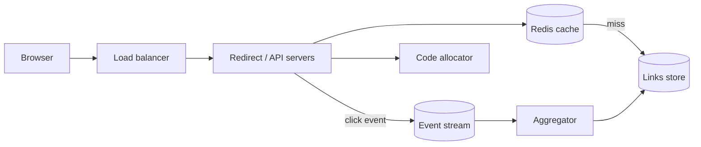

## Requirements

Functional: create a short link for a long URL, redirect when the short link is visited, optional custom alias, optional expiry, click counts per link. Non-functional: redirects must be fast (they sit in front of every page view the link drives) and highly available; codes should not be guessable; creation can be slightly slower.

## Estimates

100 million links per month is ~40 writes/s; a 100:1 ratio gives ~4,000 reads/s, peak ~40,000. Ten years of links at ~500 bytes is ~6 TB. Small. The interesting constraints are latency and availability, not throughput.

## API

```text
POST /api/links        { longUrl, alias?, expiresAt? } -> { code, shortUrl }
GET  /{code}           -> 302 Location: longUrl   (404 if unknown/expired)
GET  /api/links/{code}/stats -> { clicks, byDay[] }
```

## Data model

`links(code PK, long_url, owner_id, created_at, expires_at)` and `link_clicks_daily(code, day, count)`. The code is the primary key because every redirect is a point lookup by code.

## High-level design



Redirect servers are stateless; the cache holds `code → long_url` for hot links; the store is a key-value database or a relational database with the code as primary key. Click events are published asynchronously so the redirect path never waits on analytics.

## Deep dives

**Code generation.** Three common schemes:

1. *Base62 of a unique 64-bit id* from a Snowflake-style generator: no collisions, but sequential codes let anyone enumerate your links and estimate volume. Mitigate by encrypting or bit-shuffling the id first.
2. *Random 7-character code with a uniqueness check*: 62^7 ≈ 3.5 trillion codes, so collisions are rare; retry on conflict.
3. *Pre-generated key pool*: a service fills a table with unused random codes; API servers lease batches. Fast and collision-free at the cost of a component to run.

**301 vs 302.** A 301 (permanent) lets browsers and CDNs cache the redirect, so repeat visits never reach you: lower load, but you lose click counts. A 302 (temporary) sends every click through you, giving full analytics. Most commercial shorteners use 302 for that reason.

**Analytics.** Never increment a counter row synchronously on each redirect; it serialises writes on hot links. Emit an event (code, timestamp, referrer, user agent) to a stream and aggregate per minute or per day.

## Bottlenecks and failure modes

- A viral link produces millions of redirects per hour: the cache absorbs it, and a CDN can cache 302s briefly too.
- If the cache tier dies, the database must survive the full read load for a few minutes: size it for that or fail some requests gracefully.
- Abuse: scan destination URLs against phishing lists, rate-limit creation per user, and block known bad domains.
- Expiry: lazy-delete on read plus a background sweeper.
