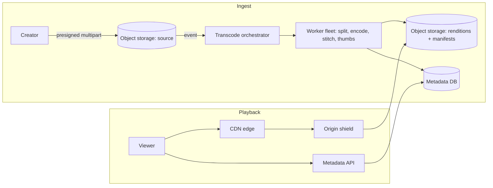

## Requirements

Creators upload videos of any length (multi-gigabyte files); the platform processes them into several qualities; viewers stream smoothly on networks from 3G to fibre, worldwide; metadata (title, description, view counts, comments) is searchable and updatable. Playback must be highly available and cheap per view, because egress is the dominant cost.

## Estimates

Peak of 5 million concurrent viewers at an average 3 Mbps is **15 Tbps** of egress. 500 hours of video uploaded per minute at ~1.4 GB/hour of source is ~1 PB/day of uploads, and renditions multiply stored bytes by 3–4×. These two numbers say: the CDN *is* the product's delivery architecture, and storage must be object storage with lifecycle tiering.

## API

```text
POST /videos                     { title, size, contentType }   -> { videoId, uploadId, partUrls[] }
PUT  <presigned part URL>        (client uploads parts directly to storage)
POST /videos/{id}/complete       { parts: [{ etag, number }] }
GET  /videos/{id}                -> { title, status, duration, manifestUrl, thumbnails }
GET  <cdn>/{id}/master.m3u8      -> manifest listing renditions
GET  <cdn>/{id}/720p/seg-00042.ts
```

## Data model

`videos(id, owner_id, title, description, status: uploading|processing|ready|failed, duration, created_at, manifest_key)`, `renditions(video_id, quality, codec, bitrate, segment_count)`, `view_counts(video_id, day, count)` updated asynchronously. Object storage holds `source/{id}` and `renditions/{id}/{quality}/seg-{n}.ts` plus manifests and thumbnails.

## High-level design



## Deep dives

**Parallel transcoding.** Split the source into chunks at keyframe boundaries (say 10 seconds each). Encode every chunk at every rendition in parallel across hundreds of workers, then stitch and generate manifests. A one-hour video that would take hours to encode serially finishes in minutes. Model the pipeline as a DAG with idempotent steps so any failed step can be retried without redoing the rest.

**Adaptive bitrate streaming.** HLS and DASH split each rendition into short segments (2–6 s) and describe them in a manifest. The player measures throughput and buffer level and requests the next segment from whichever rendition fits, so quality steps down on a congested network instead of stalling. Segments are plain HTTP objects, which is exactly what CDNs cache best.

**Fast availability.** Encode the lowest rendition (e.g. 360p) first and publish a manifest with just that; add higher renditions as they finish. The creator sees "your video is live" in a couple of minutes.

**Delivery.** Edge PoPs serve segments from cache; misses go through an origin shield that collapses requests from many PoPs into one origin fetch. For the hottest content, caches embedded in ISP networks remove transit cost entirely.

## Bottlenecks and failure modes

- **Egress cost:** every percentage point of CDN hit rate is money; tune TTLs (segments are immutable, cache forever) and pre-warm trending videos.
- **Viral spikes:** a video going from zero to millions of viewers hits the shield hard for a few minutes; the shield plus request coalescing protects the origin.
- **Transcode storms:** a burst of uploads queues jobs; autoscale workers and prioritise by creator tier or expected popularity.
- **Corrupt or hostile uploads:** validate containers and codecs before encoding; sandbox the transcoder; dead-letter inputs that fail twice.
- **Metadata hot spots:** view counters on a viral video are a write hotspot; batch increments in a stream and update the database periodically.
