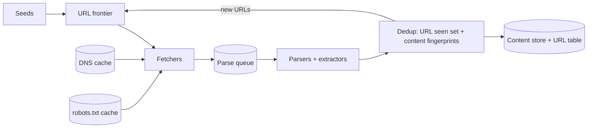

## Requirements

Starting from seed URLs, download pages, store them, extract links and keep going; revisit pages so the stored copy stays fresh. Be polite (never overload a host, obey `robots.txt`), be robust against broken or hostile sites, scale horizontally, and make it possible to add new content handlers (PDFs, images) later.

## Estimates

One billion pages a month is ~400 pages/s. At ~500 KB per page that is ~200 MB/s of download bandwidth (1.6 Gbps) and ~500 TB/month of raw HTML, perhaps 100 TB compressed. A seen-URL set of 10 billion entries at ~100 bytes is ~1 TB in a database; a Bloom filter at 10 bits per URL is ~12 GB and fits in memory.

## API

Internal interfaces: `frontier.next()` returns a URL whose host is allowed to be fetched now; fetchers publish `(url, status, headers, body)` to a parse queue; parsers publish extracted links and content records. Operators add seeds, set per-domain limits and view crawl progress.

## Data model

`urls(url_hash PK, url, host, status, priority, last_fetched_at, change_rate, content_hash, depth)`. Page bodies go to object storage keyed by `url_hash` plus fetch timestamp. A `links(from_hash, to_hash)` table (or a graph store) supports ranking and discovery. Per-host state: `robots.txt` cache with expiry, crawl-delay, last request time.

## High-level design

Every stage is a pool of stateless workers connected by queues. Fetchers only fetch; parsers only parse; the frontier decides order.

## Deep dives

**Frontier design.** The classic two-level scheme: *front queues* partition URLs by priority (PageRank-like importance, freshness need, operator boosts); a selector pulls from higher-priority queues more often. *Back queues* hold URLs for exactly one host each, with a min-heap of "earliest next fetch time" per host so a fetcher always gets a URL whose host has waited long enough. This enforces politeness with one request in flight per host and respects `crawl-delay`.

**Deduplication.** Normalise URLs first (lowercase host, remove fragments, sort query params, strip tracking params) and check a Bloom filter backed by the URL table for exact matches. For content, compute a SimHash fingerprint and compare Hamming distance to recently stored fingerprints to catch near-duplicates (mirrors, print versions).

**Freshness.** Record whether each fetch changed the content. Pages that change often get shorter recrawl intervals; static pages drift out to weeks or months. Prioritise recrawls by importance × expected change.

**Robustness.** Hard timeouts, size limits, redirect limits, and per-host URL caps so a calendar that generates infinite "next month" links cannot consume the crawl. Treat `429` and `503` as signals to back off that host.

## Bottlenecks and failure modes

- **DNS:** 400 lookups/s to a shared resolver will throttle; run a local caching resolver.
- **Hot hosts:** large sites have millions of pages; politeness means they crawl slowly by design, so spread across many hosts in parallel.
- **Frontier size:** billions of pending URLs do not fit in memory; keep the hot head in memory and spill to disk or a database.
- **Crash recovery:** checkpoint frontier state and fetch progress; make fetch and store idempotent so replaying a queue is safe.
- **JavaScript pages:** headless browsers cost 10–100× more per page; use them selectively for high-value sites.
