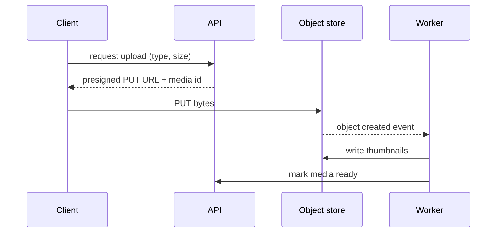

Putting binary files in a relational database works at small scale and then hurts everywhere: backups balloon, replication lag grows, buffer cache fills with pixels, and every download ties up a database connection. The standard pattern separates bytes from facts.

**Object storage holds the bytes.** S3-style stores offer effectively unlimited capacity, eleven nines of durability through cross-AZ replication, lifecycle rules to tier cold objects to cheaper storage, and HTTP access to every object. Keys are opaque strings, so use something like `uploads/{user_id}/{uuid}.jpg` to avoid hot prefixes and leaking sequential ids.

**The database holds metadata.** A `media` row stores the owner, object key, content type, size, dimensions, processing status and permissions. Queries, listings and access control run against this row, never against the bucket.

**Uploads via presigned URLs.** The client asks your API for permission to upload; the API validates (size, type, quota), creates a pending `media` row, and returns a presigned PUT URL that is valid for a few minutes and bound to that key. The client uploads straight to the bucket. Your servers never see the bytes, so a thousand simultaneous 100 MB uploads cost you almost nothing. For large files use multipart upload so parts can be retried and resumed.

**Downloads via CDN.** Put a CDN in front of the bucket. Public assets use cache-friendly immutable URLs; private ones use short-lived signed URLs or signed cookies issued by your API after an authorisation check.

**Processing.** The bucket emits an event on object creation; a worker generates thumbnails or transcodes video, writes derivatives back, and marks the `media` row ready. The UI shows a placeholder until then.

Close with the orphan problem: a periodic job reconciles pending rows older than an hour against the bucket and deletes whichever side is missing.
