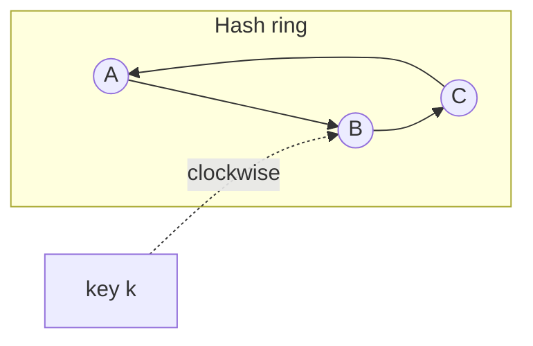

**The problem.** The naive way to pick a server for a key is `hash(key) mod N`. Go from 4 servers to 5 and the modulus changes, so roughly 80% of keys now map somewhere else. In a cache that is a near-total miss storm; in a database it is a massive data migration.

**The ring.** Hash each server's identifier onto a circle of hash values (say 0 to 2^32). Hash each key onto the same circle and walk clockwise to the first server you meet; that server owns the key. Adding a server only claims the arc between it and its counter-clockwise neighbour, so about 1/N of keys move and every other key stays put. Removing a server hands its arc to the next server clockwise.

**Virtual nodes.** With one point per server the arcs are uneven and a failure dumps an entire arc on one neighbour. Instead give each physical server many points (e.g. 100–200 "vnodes"). Load evens out statistically, a failed node's keys scatter across many successors, and a bigger machine can simply get more vnodes.

**Replication.** Store each key on the first R distinct physical nodes clockwise from it; this is how Dynamo and Cassandra place replicas.

**Alternatives.** Rendezvous hashing scores every node per key and picks the top one; it has the same minimal-movement property without a ring structure. Jump consistent hash is compact and fast but only supports adding or removing the last bucket.

Say the problem (remapping), the mechanism (ring, clockwise), the refinement (vnodes), and where it is used.
