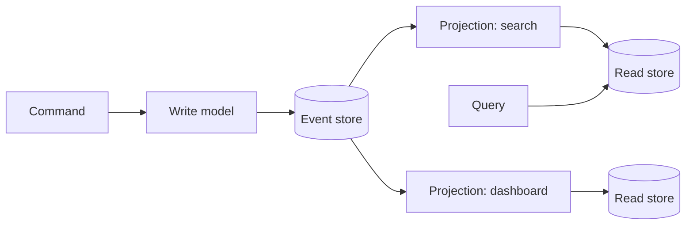

**CQRS (Command Query Responsibility Segregation).** Most apps use one model for both updating and reading data. CQRS splits them: *commands* go to a write model that enforces business rules, and *queries* go to read models that are denormalised and shaped for each screen or API. The read models can live in different stores (Postgres for the write side, Elasticsearch for search, Redis for a leaderboard) and are updated from the write side's changes.

**Event sourcing.** Instead of storing current state (`balance = 80`), store every change as an immutable event (`Deposited 100`, `Withdrew 20`) in an append-only log per aggregate. Current state is computed by replaying events. The log is the truth; everything else is a cache.

**How they combine.** The write side appends events; projections subscribe to the event stream and update each read model. A new requirement ("show me how many users downgraded last quarter") becomes a new projection that replays history rather than a migration that guesses.

**Why bother**

- Complete audit trail by construction; regulators love it.
- Temporal queries ("what did this order look like at 3 pm?").
- Debugging by replaying production events into a test environment.
- Read models tuned per use case without compromising the write model.

**Why it is expensive**

- Read models lag the write side; the UI must tolerate not seeing its own write immediately.
- Events are forever, so schema changes require upcasters or versioned event types.
- Long-lived aggregates need snapshots or replay gets slow.
- Idempotent projections, replays, and rebuilding stores all need tooling.
- Teams need a shared understanding of the pattern or it decays into chaos.

Recommend it for domains where history *is* the product (ledgers, orders, collaboration) and steer away from it for simple CRUD.
