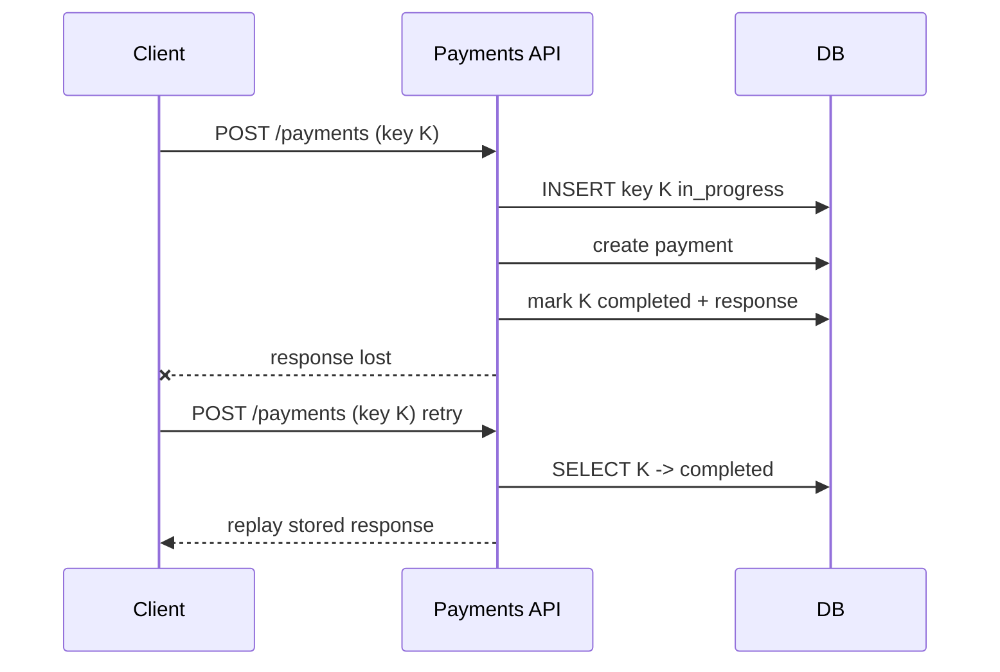

A client calls `POST /payments`, the network drops the response, and the client retries. Without protection the customer is charged twice. Idempotency keys make the retry safe.

**Flow**

1. The client generates a UUID for the *intent* ("pay this invoice") and sends it as `Idempotency-Key`. Every retry of that intent reuses the same key.
2. The server does an atomic insert into an `idempotency_keys` table keyed by `(account_id, key)` with status `in_progress` and a hash of the request body.
   - Insert succeeds: this is the first attempt; proceed.
   - Insert conflicts and the stored body hash differs: return `422`, the client reused a key for a different request.
   - Insert conflicts and status is `completed`: return the stored response (same status code and body).
   - Insert conflicts and status is `in_progress`: return `409` with a `Retry-After`, or block briefly on the row lock and then return the completed result.
3. Perform the work. If it involves side effects outside your database (calling a card network), pass your own idempotency key downstream so *their* retries are safe too.
4. Store the response against the key and mark it `completed`, ideally in the same transaction as the business write so they cannot diverge.

**Edge cases**

- *Crash between step 3 and 4:* the key stays `in_progress`. Use a lease timeout so a retry after the lease can re-run from a checkpoint, or make the business write and key update one transaction.
- *Expiry:* keep keys for 24 hours or more; after that a retry is treated as new, which is acceptable because clients do not retry for days.
- *Scope:* namespace keys by account so two tenants can never collide.

State the atomic insert, the stored response, the mismatch check, and the TTL.
