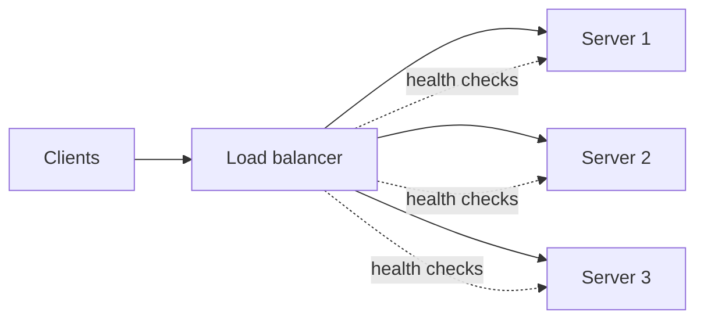

A load balancer spreads incoming requests across a pool of servers so that no single server becomes a bottleneck and the pool can grow or shrink without clients noticing.

**Static algorithms** decide without looking at live server state:

- **Round robin** hands each request to the next server in the list. Simple and fair when every request costs about the same.
- **Weighted round robin** sends proportionally more traffic to bigger servers.
- **Hash-based** (IP hash, URL hash, consistent hashing) maps a key to a server so the same key keeps landing in the same place, which helps local caches and sticky sessions.

**Dynamic algorithms** use feedback:

- **Least connections** picks the server with the fewest open connections. Good for long-lived or uneven requests.
- **Least response time** adds latency into the choice.
- **Power of two choices** picks two servers at random and uses the less loaded one; it gets most of the benefit of least connections without global knowledge, which matters for distributed balancers.

Whatever the algorithm, pair it with **health checks** so failing servers are removed quickly, and run the balancer itself as an HA pair or behind DNS/anycast so it is not the single point of failure you just moved.

