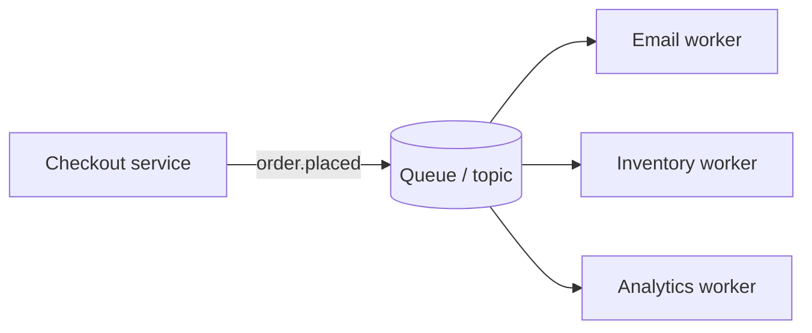

A synchronous call couples two services tightly: the caller waits, and if the callee is slow or down the caller is too. A queue in between changes the contract: the producer writes a message and moves on; a consumer picks it up when it can.

**What you gain**

- **Temporal decoupling.** The consumer can be deploying, restarting or simply slower than the producer.
- **Load levelling.** A checkout spike produces 10,000 "send receipt" messages in a minute; the email workers drain them at 500 per minute without falling over.
- **Independent scaling.** Add consumers to drain faster; the producer never changes.
- **Resilience patterns for free.** Retries with backoff, dead-letter queues for poison messages, and fan-out to multiple consumers via topics.

**What you pay**

- **Asynchrony leaks into the product.** "Your export is being prepared" instead of "here is your export". You need status tracking, notifications or polling.
- **Delivery semantics.** Most queues are at-least-once; consumers must be idempotent. Ordering is usually per partition or per queue, not global.
- **Observability.** Queue depth and consumer lag become key health signals; a growing backlog is a silent outage.
- **A new dependency.** The broker itself must be highly available and sized for retention during a long consumer outage.

Interviewers want you to say *why* this particular edge should be async (the caller does not need the result, or the work is slow or bursty) and then immediately name the two consequences: idempotent consumers and a plan for telling the user when the work is done.
